# AssetManager 当前代码架构图册

> 日期：2026-09-06。基于 HEAD `6c70153b642f9d7a139937ae5d73da94325eebd8` 及绘制时的未提交工作区代码。
> 这是源码静态走查图册，不是运行验证或未来设计。覆盖生产模块、主要调用与所有权、持久化、异步数据流和开发入口；不将每条函数调用挤进一张图。完整文件与静态 import 索引见配套生成文件。

## 阅读方式

先看 01 总览，再按需求查看分图。实线表示调用、数据流或明确标注的所有权；虚线表示事件、可选分支或间接关系。各图的箭头不是统一的 Python import 图，完整静态 import 另见 `source-inventory.json`。同一分组内列出的服务不一定是同一个实例或共用事务。

| 图 | 解决的问题 |
|---|---|
| 01 系统总览 | 桌面、浏览器、Python 进程、外部依赖在哪里 |
| 02 服务装配 | 应用级与资产库级对象如何创建、谁拥有谁 |
| 03 生命周期 | 打开、切换、关闭资产库时资源如何回收 |
| 04 桌面结构 | 窗口、面板、网格、控制器和后台任务如何协作 |
| 05 服务与数据 | 业务功能分别落在哪些服务和存储组件 |
| 06 存储结构 | 原始文件、库数据库、缓存和全局设置如何划分 |
| 07 实时同步 | 一次写操作如何使桌面和浏览器刷新 |
| 08 WebUI | 页面、认证、API、查询缓存和实时事件如何连接 |
| 09 LAN 请求 | 中间件、路由、身份、权限和传输边界 |
| 10 媒体链路 | 图片快照、缩略图、解码、隐私模糊和缓存 |
| 11 下载链路 | 单文件、批量 ZIP、配额和清理所有权 |
| 12 后台恢复 | 文件操作、导入、监听、持久队列和补偿 |
| 13 扩展与外观 | 插件、命令、MCP、主题和背景渲染 |
| 14 工程验证 | 哪些测试和构建入口覆盖哪些边界 |

## 01 系统总览

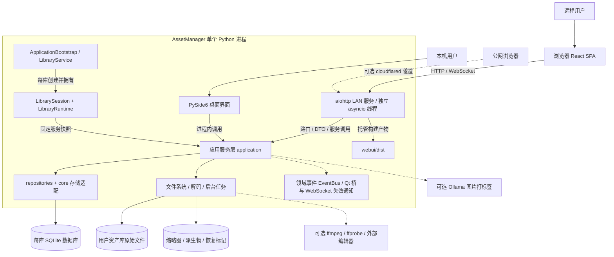

定位：这是文件资产管理程序。原始资产保留为普通文件；SQLite 保存标签、备注、索引、分享和其他应用数据。桌面和 LAN 在同一进程中运行，浏览器通过 HTTP 访问 LAN。跨进程队列协议的存在不表示支持多个应用同时拥有同一资产库。

源码：[应用入口](../AssetsManager/app.py)、[LAN 实现](../AssetsManager/lan/server.py)、[运行时](../AssetsManager/application/runtime.py)、[SPA 根组件](../webui/src/App.tsx)。

## 02 服务装配与所有权

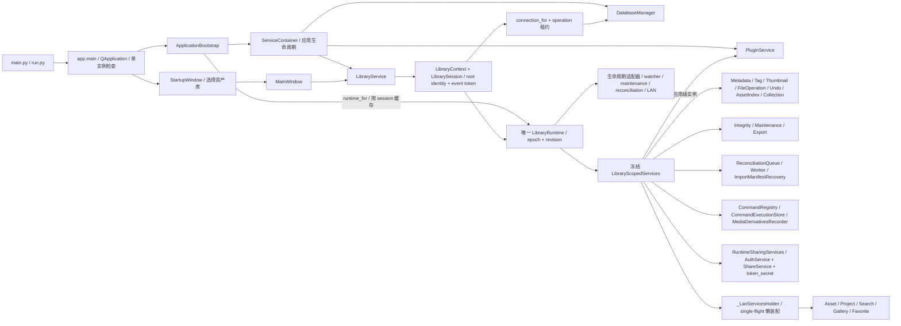

- 容器只注册应用级 `DatabaseManager`、`LibraryService`、`PluginService`；库级服务不能随意从全局容器重新取得。
- `LibraryScopedServices` 是冻结快照，但其中引用的服务具有内部可变状态。冻结不等于全部对象不可变。
- `AuthService`、`ShareService` 和运行时密钥在库级快照中创建，不随每次 LAN 启停重建。LAN 本地 UI 密钥另由运行时密钥和认证配置派生。
- `_build_services` 创建写入侧 `SearchIndexService`；懒装配 `_build_lan_services` 创建自己的搜索索引/资产索引服务对象，共享同一 session 数据库，不能画成所有调用都使用唯一索引服务实例。
- `ImportService`、重关联函数和 AI 打标签等还有按使用场景装配的入口，不全部属于快照字段。`FreeDownloadQuotaService` 通过 LAN 请求辅助层绑定当前库。

源码：[装配根](../AssetsManager/application/bootstrap.py)、[容器](../AssetsManager/di/__init__.py)、[session](../AssetsManager/application/context.py)、[库管理](../AssetsManager/application/library_service.py)。

## 03 资产库生命周期

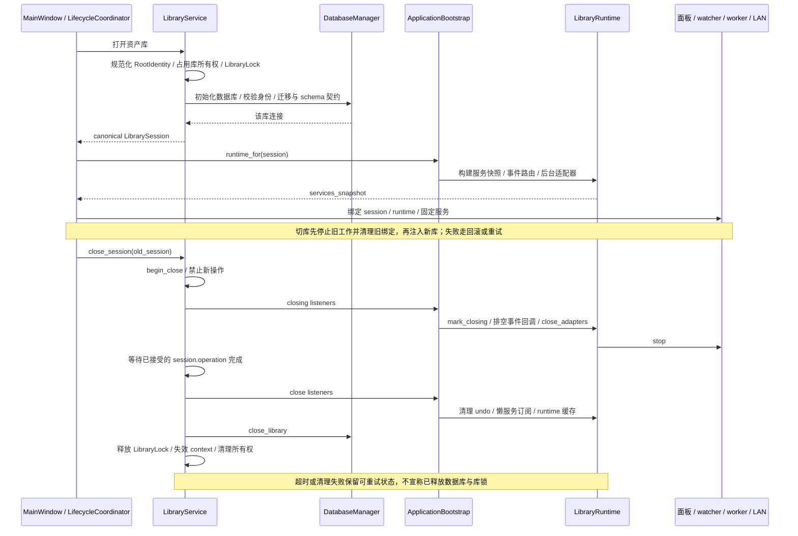

桌面切库还包含 LAN 状态恢复、面板预清理、标签工作区和布局保存。`WindowLifecycleCoordinator` 负责这些 UI 编排；`LibraryService._run_owned_teardown` 才是 session/数据库/库锁的最终关闭所有者。`Runtime.close()` 自身不关闭数据库。

源码：[窗口生命周期](../AssetsManager/window_lifecycle_coordinator.py)、[统一面板清单](../AssetsManager/window_scoped_panels.py)、[库生命周期](../AssetsManager/application/library_service.py)、[运行时关闭](../AssetsManager/application/runtime.py)。

## 04 桌面结构

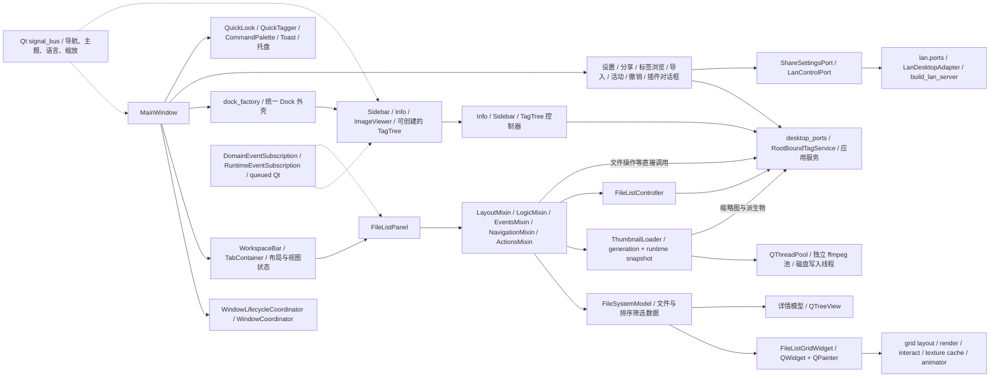

当前文件网格不是旧 `QListView` 实现；详情模式才使用 `QTreeView`。控制器不依赖 Qt，但面板并非所有行为都经过控制器，文件操作和媒体加载仍有直接服务调用。`TagTreePanel` 可由工厂创建，当前标签浏览对话框也持有自己的实例，不应假定它始终作为主窗口 Dock 挂载。

源码：[主窗口](../AssetsManager/window.py)、[文件面板组成](../AssetsManager/panels/file_list/_base.py)、[画布](../AssetsManager/panels/file_list/_grid_widget.py)、[缩略图加载器](../AssetsManager/panels/file_list/_loader.py)、[控制器目录](../AssetsManager/controllers/)、[桌面端口](../AssetsManager/application/desktop_ports.py)。

## 05 应用服务与数据依赖

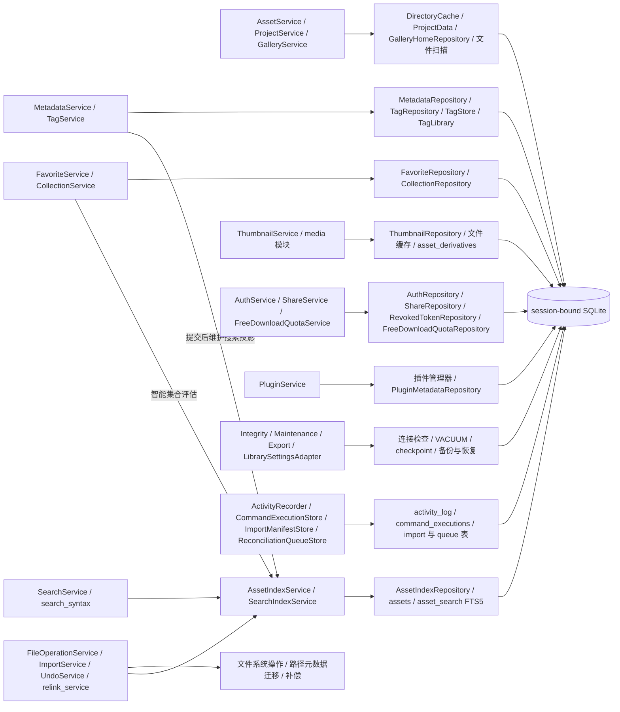

服务分组的开发含义：

| 功能 | 主要入口 | 关键约束 |
|---|---|---|
| 浏览与分类 | `asset_service.py`、`project_service.py`、`asset_filters.py` | 文件系统和缓存仍参与读路径，不是全部只读数据库 |
| 标签、备注、链接、评分 | `tag_service.py`、`metadata_service.py` | 写入后发布带库身份的事件；标签和备注也维护搜索索引 |
| 搜索 | `search_service.py`、`search_index_service.py`、`search_syntax.py` | 文件扫描、索引、FTS 多条路径；结果含完整性/降级状态 |
| 集合 | `collection_service.py` | 普通集合是路径引用；智能集合保存查询条件，不移动原文件 |
| 文件操作和撤销 | `file_operation_service.py`、`undo_service.py` | 原文件变化与数据库不能构成单一原子事务，需要修复机制 |
| 导入 | `import_service.py`、`import_manifest_store.py` | 规划预算、指纹、逐项状态、取消和重启恢复 |
| 重关联 | `relink_service.py` | 修复外部移动留下的元数据路径；本身不移动用户文件 |
| 分享与配额 | `share_service.py`、`auth_service.py`、`free_download_quota_service.py` | 绑定 session；HTTP 身份解析和业务规则分层 |
| 维护与备份 | `library_settings_adapter.py`、`library_export_service*.py` | 恢复需要关闭会话并持有恢复 reservation |

并非所有 SQL 都在 `repositories/`：搜索索引、活动日志、命令日志、导入和协调队列等应用模块也持有会话连接并执行 SQL。图中对此单列，不把理想分层写成事实。`domain/` 包含值对象、事件和错误类型；当前也引用 `core` 的部分契约与工具，并非严格零 import 的独立领域包。

源码：[服务装配](../AssetsManager/application/bootstrap.py)、[仓库公共约束](../AssetsManager/repositories/_common.py)、[搜索语法](../AssetsManager/application/search_syntax.py)、[领域资产对象](../AssetsManager/domain/asset.py)。

## 06 存储结构与一致性

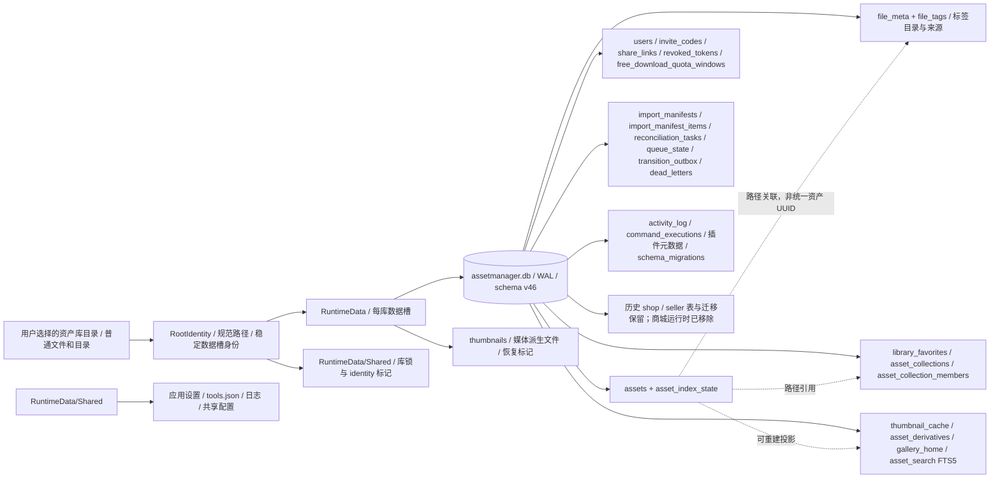

这是存储分组图，虚线是逻辑路径关联，不承诺数据库中存在外键。文件移动需要同步迁移 `file_meta`、`file_tags`、收藏、集合成员、缩略图和派生物等路径记录。

- 路径由 `path_resolver` 统一计算；运行数据根目录不能简单硬编码为源代码目录。库槽有完整身份标记以防摘要槽冲突。
- 每库使用受管理的 SQLite 连接，`check_same_thread=False`，开启 WAL；读写通过连接级锁等机制协调。WAL 不等于同一个连接可无锁并发写。
- 仓库公共基类处理 session/root 校验、操作租约、SAVEPOINT、事务所有权和可选 SQLITE_BUSY 重试；涉及竞争更新的服务另用 revision/lease/token CAS。
- `schema_defs.py` 定义契约，`db_migrations.py` 当前最高版本为 46。历史商城 schema 的存在不代表商城功能仍可用。
- 原文件是内容来源；索引、缩略图、画廊和全文搜索是派生数据。备份恢复必须区分资产文件和应用数据，不能只复制一个正在使用的数据库文件。

源码：[路径解析](../AssetsManager/core/path_resolver.py)、[数据库](../AssetsManager/core/database.py)、[schema](../AssetsManager/core/schema_defs.py)、[迁移](../AssetsManager/core/db_migrations.py)、[仓库事务](../AssetsManager/repositories/_common.py)。

## 07 写入与实时同步

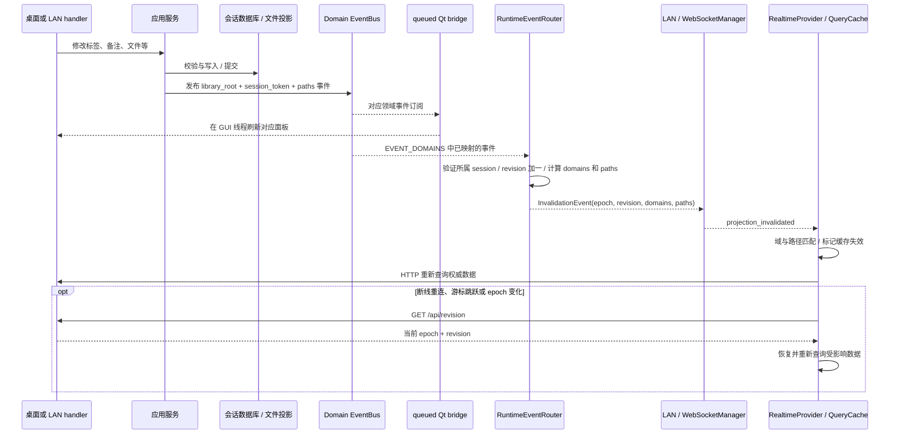

领域总线是进程内共享的；运行时路由依据库根和 `session_token` 隔离事件。`RuntimeEventSubscription` 也可直接将投影失效转为 Qt 排队信号。`signal_bus.py` 只承担主题、导航等 UI 协调，不代替业务事件。

当前事实需保留：`AssetRatingChanged` 已由评分服务发布，但不在 `runtime_events.EVENT_DOMAINS` 中，因此不能把评分变化画成已自动广播给其他网页的完整链路；`MaintenanceChanged` 则是有意直接供 UI 订阅的维护通知，不属于投影失效事件。本图只对已映射事件成立。

源码：[领域事件](../AssetsManager/domain/events.py)、[运行时映射](../AssetsManager/application/runtime_events.py)、[Qt 桥](../AssetsManager/panels/_event_bridge.py)、[LAN 事件接线](../AssetsManager/lan/api.py)、[前端实时恢复](../webui/src/stores/RealtimeContext.tsx)。

## 08 WebUI 结构

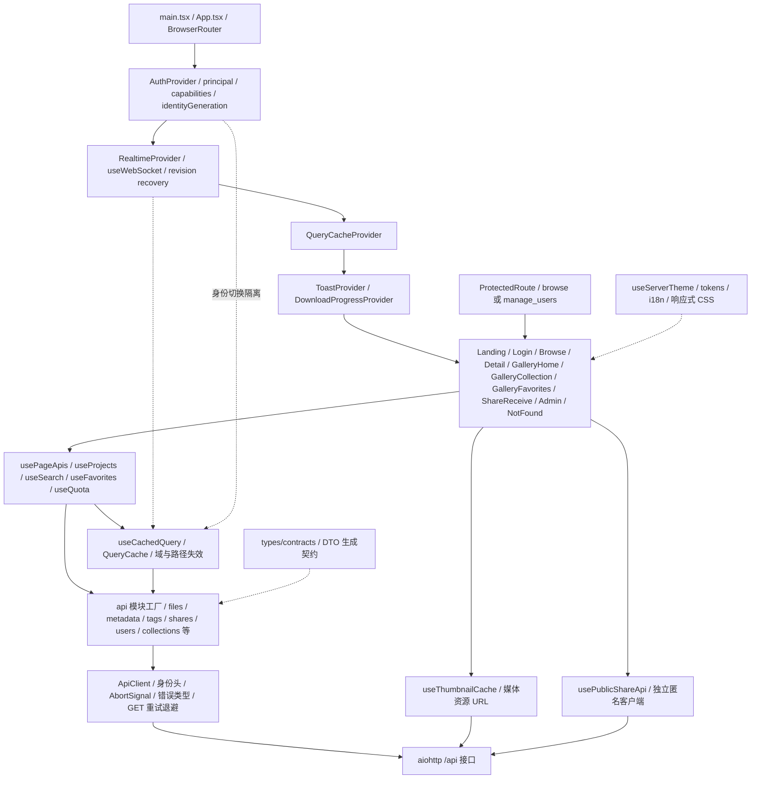

- 页面通过 hooks 获取 API，缓存读路径使用 `useCachedQuery`。单独的 `usePublicShareApi` 避免分享密码错误的 401 被全局认证当成用户登录失效。
- 浏览器路由访问限制用于界面行为；实际数据权限仍由服务端验证，不能只依赖 `ProtectedRoute`。
- React 当前包含 `/admin` 路由；配套路由清单另列 aiohttp 注册路径。客户端路由与服务端 SPA 回退规则是两份配置，不应默认完全相同。
- `api/*`、`types/*`、错误和失效契约是接口变化时需要联动的位置。

源码：[根组件](../webui/src/App.tsx)、[页面 API 入口](../webui/src/hooks/usePageApis.ts)、[API 客户端](../webui/src/api/client.ts)、[查询缓存](../webui/src/cache/queryCache.ts)、[缓存失效规则](../webui/src/cache/invalidation.ts)、[认证上下文](../webui/src/stores/AuthContext.tsx)。

## 09 LAN 请求、安全与传输边界

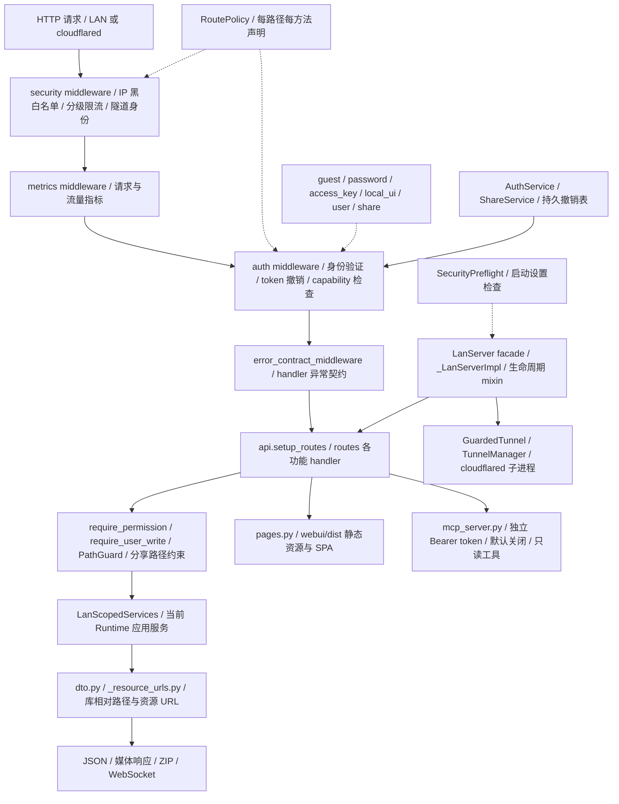

| 路由模块组 | 职责 |
|---|---|
| `files`、`metadata`、`quicksearch` | 文件与目录摘要、项目树、搜索、备注和评分 |
| `tags`、`collections`、`favorites`、`gallery` | 资产组织与画廊投影 |
| `image`、`thumbnails`、`sequence` | 图片、缩略图和序列邻居 |
| `downloads`、`quota`、`shares` | 下载、配额、分享验证与获取内容 |
| `auth`、`users` | 登录、访问密钥、用户、邀请码和写权限 |
| `system`、`websocket`、`pages` | 服务信息、游标、活动与统计、实时连接和网页 |
| `lan/mcp_server.py` | 只读 MCP 协议入口，不在 `routes/` 子包中 |

服务层返回业务数据；URL 和 HTTP 状态在 LAN 层组装。路由存在能力校验和输入解析，不能把所有 validation 一概画成已下沉。中间件顺序按当前 `_build_app` 记录，错误契约中间件在最内层，不代表外层所有异常都经过它。

源码：[LAN 装配](../AssetsManager/lan/server.py)、[路由注册](../AssetsManager/lan/api.py)、[策略](../AssetsManager/lan/route_policy.py)、[身份](../AssetsManager/lan/principal.py)、[能力](../AssetsManager/lan/authorization.py)、[路径守卫](../AssetsManager/lan/path_guard.py)。

## 10 媒体、缩略图与缓存

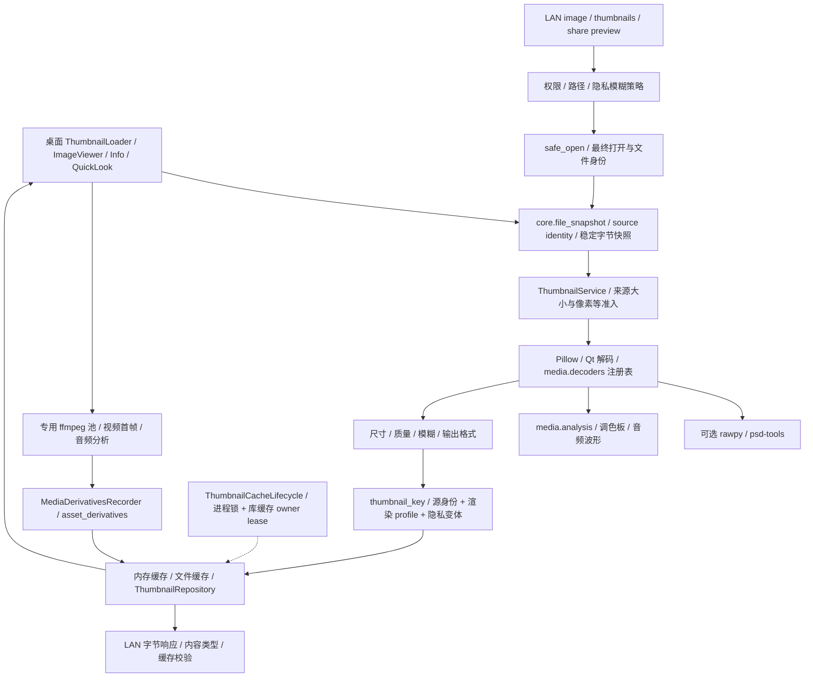

这是各媒体消费者共有机制的分组图，不意味着桌面和 LAN 使用完全相同的解码函数。当前工作区的快照改动要保证来源身份、用于解码的字节和响应缓存校验相互一致；缩略图缓存还需要区分渲染 profile 和模糊策略。普通资源缓存命中不应绕过当前访问权限。

视频首帧与音频波形属于派生能力，依赖外部工具可用性；专业图片解码是可选依赖。文件扩展名可分类不代表内置三维模型实时渲染或完整文档预览。

源码：[缩略图服务](../AssetsManager/application/thumbnail_service.py)、[文件快照](../AssetsManager/core/file_snapshot.py)、[媒体解码](../AssetsManager/application/media/decoders.py)、[派生物](../AssetsManager/application/media/derivatives.py)、[缓存生命周期](../AssetsManager/application/thumbnail_cache_lifecycle.py)、[图片路由](../AssetsManager/lan/routes/image.py)。

## 11 下载、ZIP 资源与清理

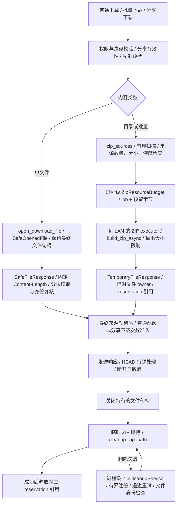

- 单文件 `SafeFileResponse` 从已打开的句柄传输，不在发送时重新打开可变化的路径。读取校验来源身份；响应头发出后错误只能中止连接。
- ZIP job 和存储预留是进程级预算；ZIP 构建 executor 是每 LAN 实例所有。取消构建或取消请求时，builder、response 和清理回调各自持有的 reservation 引用必须最终释放。
- 普通配额与分享次数是两种计数入口，本图将其分支汇总，不表示所有请求都会扣两次。准入后的传输中断仍可能计数，不能将“准备好响应”表述成“客户端完整接收后才扣次”。
- `ZipCleanupService` 只重试显式注册的临时归档；当前实现没有目录扫描或进程重启后的孤儿 ZIP 自动恢复。
- 本节包含绘制时尚未提交的 `file_response.py`、`temporary_file_response.py`、`zip_resources.py`、`zip_sources.py` 和 `zip_cleanup.py`。

源码：[普通下载](../AssetsManager/lan/routes/downloads.py)、[分享下载](../AssetsManager/lan/routes/shares.py)、[ZIP 构建辅助](../AssetsManager/lan/routes/_helpers.py)、[文件响应](../AssetsManager/lan/file_response.py)、[临时响应](../AssetsManager/lan/temporary_file_response.py)、[ZIP 预算](../AssetsManager/lan/zip_resources.py)、[清理服务](../AssetsManager/lan/zip_cleanup.py)。

## 12 文件操作、导入与后台恢复

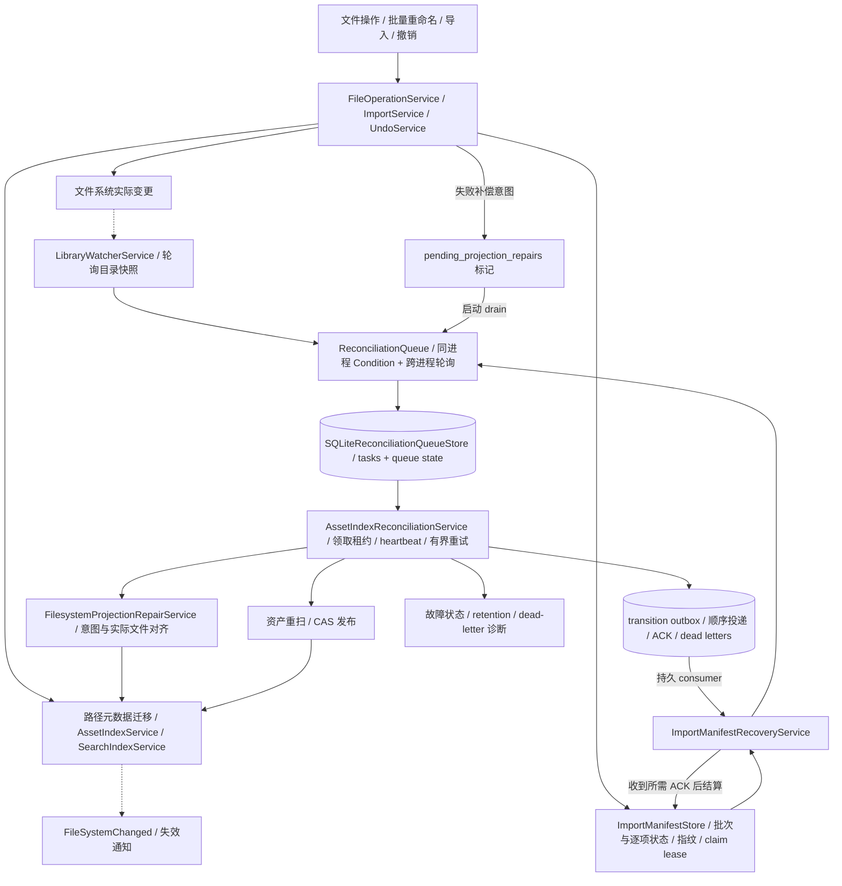

- 入队成功与索引修复完成是不同状态。导入恢复需要匹配的持久 transition ACK，不能在 enqueue 返回时直接宣称恢复完成。
- 运行时启动会重投未入队的修复标记并恢复导入 manifest；重试有预算、租约身份和失败状态，不是无限循环。
- 持久队列不是领域事件总线。领域总线提供进程内通知；队列和 outbox 承担跨重启恢复与确认。
- 常驻 `LibraryWatcherService` 由配置控制；桌面导航仍有自己的 `QFileSystemWatcher`，两者用途不同。
- 自动监听不是内容级实时文件版本系统。备份恢复和外部移动重关联还有独立入口。

源码：[文件操作](../AssetsManager/application/file_operation_service.py)、[导入](../AssetsManager/application/import_service.py)、[manifest](../AssetsManager/application/import_manifest_store.py)、[队列](../AssetsManager/application/reconciliation_queue.py)、[队列存储](../AssetsManager/application/reconciliation_queue_store.py)、[协调 worker](../AssetsManager/application/asset_index_reconciliation_service.py)、[监听](../AssetsManager/application/library_watcher_service.py)。

## 13 插件、命令、AI 与外观

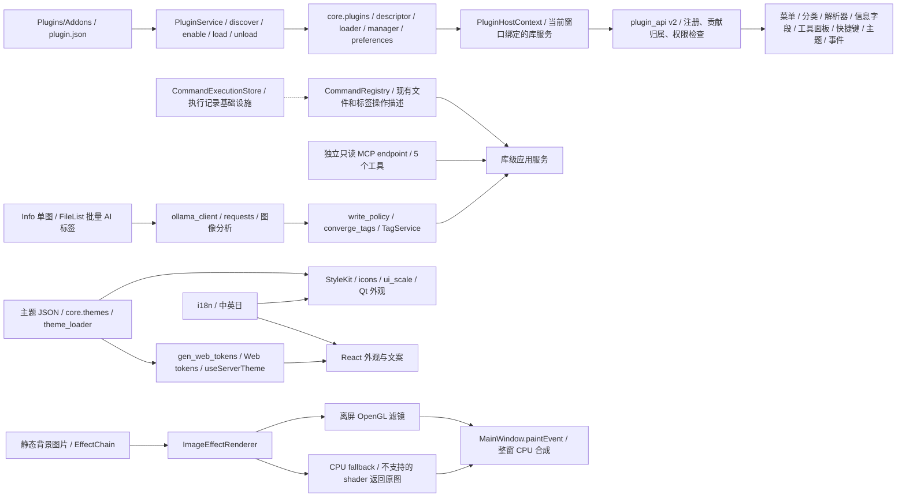

插件与主程序在同一 Python 解释器中执行，权限声明不是隔离沙箱。当前内置插件包括 `booth_link` 和 `download_tracker`，后者 manifest 默认禁用。

`CommandRegistry` 是已有命令描述和处理入口，桌面保留自己的调用路径；`CommandExecutionStore` 是单独装配的执行记录能力，不能据此推断所有操作都自动写命令日志。当前 MCP 仅有 `search_assets`、`get_asset_metadata`、`list_collections`、`evaluate_smart_collection`、`recent_activity` 五个只读工具，未暴露命令注册表的写操作。

背景是静态图像滤镜系统，GPU 用于离屏处理，最后仍由窗口 `paintEvent` 合成；不是视频壁纸或整窗 `QOpenGLWidget` 渲染。

源码：[插件 API](../AssetsManager/plugin_api/__init__.py)、[插件主机](../AssetsManager/core/plugins/host_context.py)、[命令注册表](../AssetsManager/application/command_registry.py)、[MCP](../AssetsManager/lan/mcp_server.py)、[AI 标签](../AssetsManager/application/ai_tagging/service.py)、[背景管线](../AssetsManager/background/pipeline.py)。

## 14 工程验证与构建

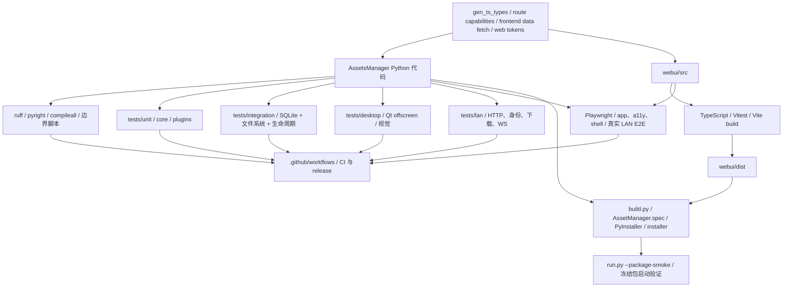

此图描述工程入口，不表示本轮执行过这些检查，也不表示每次 CI 都运行全部测试。`pytest.ini` 默认排除 `e2e` 和 `perf`，性能与真实浏览器验收需要显式运行。发布能力不能用本地图册生成结果替代验证。

源码：[pytest 配置](../pytest.ini)、[Web 工程配置](../webui/package.json)、[构建脚本](../build.py)、[冻结包定义](../AssetManager.spec)、[CI 目录](../.github/workflows/)。

## 开发任务定位表

| 接下来要改什么 | 优先查看 | 需要联动关注 |
|---|---|---|
| 网格、缩放、选择、拖拽、动画 | `panels/file_list/_grid_*`、`_animator.py`、`_base_*` | 布局尺寸、模型一致性、缩略图代际、桌面测试 |
| 文件操作、导入、撤销 | `file_operation_service.py`、`import_service.py`、`undo_service.py` | 所有路径关联记录、修复队列、取消和恢复 |
| 标签、备注、评分 | 对应 service、repository、Info 与 LAN 路由 | 搜索索引、领域事件、EVENT_DOMAINS、前端缓存 |
| 搜索、智能集合 | `search_syntax.py`、`search_service.py`、`collection_service.py` | CJK 短词、FTS、筛选语义、结果降级状态 |
| 切库、窗口关闭、服务重启 | `window_lifecycle_coordinator.py`、`library_service.py`、`runtime.py` | 后台排空、订阅、数据库和库锁的释放顺序 |
| Web 页面或 HTTP 接口 | `webui/src/pages`、`hooks`、`api`、`lan/routes`、`dto.py` | 错误与类型契约、权限、路径 URL 转换 |
| 分享、下载、限流 | `lan/api.py`、`server.py`、`security.py`、`authorization.py`、下载路由 | 单文件句柄、HEAD、ZIP 预算、配额和取消清理 |
| 媒体预览与缓存 | `thumbnail_service.py`、`file_snapshot.py`、`media`、`_loader.py` | 快照身份、缓存键、模糊策略、可选依赖 |
| 持久化字段 | `schema_defs.py`、`db_migrations.py`、对应 repository/service | 新旧迁移、备份恢复、路径迁移、契约生成 |
| 插件或自动化 | `core/plugins`、`plugin_api`、`command_registry.py`、`mcp_server.py` | 当前库绑定、权限实际边界、贡献卸载、只读与写入口差异 |
| 主题和视觉 | `themes.py`、主题 JSON、`StyleKit`、`background`、Web tokens | 桌面/Web 同源、语言、缩放、视觉回归 |

## 配套文件与证据范围

- [独立图源与源码索引](diagrams/code-atlas-2026-09-06/README.md)：每张图的 `.mmd`、生产文件清单和自动提取的 HTTP 注册项。
- `source-inventory.json` 记录生产源文件 SHA-256、Python AST import、顶层符号和路由注册源码位置。它不读取用户资产、运行数据库或应用设置内容。
- Python 静态 import 列表包含函数内和 `TYPE_CHECKING` 导入；不是运行时调用图。React 的动态行为按本图册已读取的入口说明，清单不声称解析了完整 TypeScript 调用图。
- 此文档记录当前代码，也记录尚未接通或刻意分离的能力；后续实现改变时，应更新相应分图并重新生成索引。
