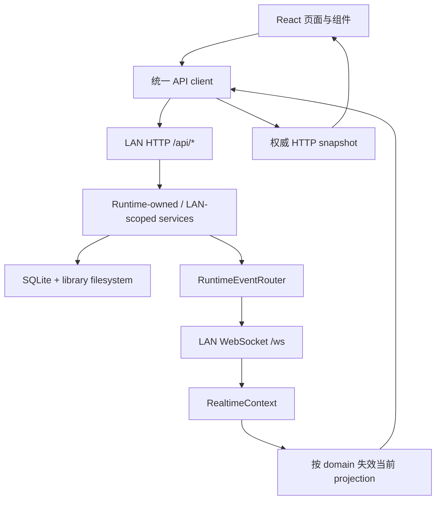

# 02 — WebUI 架构与运行边界

## 1. 总体数据流



核心原则：WebSocket 只告诉前端“某些 projection 可能变化了”；SQLite、文件系统以及由 HTTP route 返回的 snapshot 才是权威来源。

## 2. Provider 与路由层

当前组合位于 [`webui/src/App.tsx`](../../../../webui/src/App.tsx)：

```text
BrowserRouter
└─ AuthProvider
   └─ RealtimeProvider
      └─ ToastProvider
         └─ DownloadProgressProvider
            └─ Routes
```

| 路由 | 页面 | 进入条件 |
|---|---|---|
| `/` | `LandingPage` | 公开 |
| `/login` | `LoginPage` | 公开 |
| `/browse` | `BrowsePage` | `browse` capability |
| `/detail` | `DetailPage` | `browse` capability |
| `/s/:shareId` | `ShareReceivePage` | 分享自己的访问语义 |
| `*` | `Navigate to="/"` | — |

不要把管理页面或分享页面的权限判断只放在 React 路由上。前端 capability 只是 UX gate，LAN route 仍会在服务端重新执行权限检查。

## 3. AuthContext 边界

[`AuthContext.tsx`](../../../../webui/src/stores/AuthContext.tsx) 暴露：

- `principal`、`user`、`role`、`capabilities`；
- `isAuthenticated`、`isLoading`、`authMode`、`serverInfo`；
- `identityGeneration`；
- `api`、`authApi`、`systemApi`；
- `logout()`、`refreshMe()`。

初始化顺序：

1. 请求 `/api/info` 获取 server info、auth mode 和可能的 principal/capabilities。
2. 如果 `auth_enabled=false`，采用 server 返回的 principal；不要前端自行假设所有 guest 都有 browse。
3. 如果认证开启，调用 `/api/auth/me`，依赖同源 HttpOnly cookie 恢复 session。
4. 401 由 API client 统一通知 AuthContext；旧请求/旧身份不得重新写入当前状态。

身份切换会递增 `identityGeneration`。RealtimeContext、thumbnail cache 和页面数据应把它当作废弃旧快照的边界。

## 4. RealtimeContext 边界

[`RealtimeContext.tsx`](../../../../webui/src/stores/RealtimeContext.tsx) 是唯一的实时状态投影层，负责：

- 创建/关闭中央 WebSocket transport；
- 维护 `epoch`、`revision`；
- 识别旧 epoch、旧 revision 和 revision gap；
- 使用 `/api/revision` 恢复 cursor；
- 将 `projection_invalidated` 分发给具体 domain 的订阅者；
- 在 identity 变化时清空旧 cursor 和旧订阅影响。

当前 domain 集合：

```text
files, tree, home, project_detail, metadata,
tags, shares, users, activity, online_users, stats
```

组件通过 [`useInvalidation.ts`](../../../../webui/src/hooks/useInvalidation.ts) 注册 callback。callback 收到事件后应重新读取自己负责的 HTTP snapshot；不要直接从 event 的 `paths` 推导完整数据。

## 5. WebSocketTransportHost 边界

[`useWebSocket.ts`](../../../../webui/src/hooks/useWebSocket.ts) 提供：

- 同源 `/ws` 连接；HTTP 使用 `https:` 时自动使用 `wss:`；
- 指数退避重连，最大间隔 30 秒；
- `connecting`、`connected`、`disconnected` 状态；
- 中央 host 的 event fan-out；
- 连接清理和旧 socket 忽略。

生产 `/ws` route 会拒绝 query-string `token` 或 `key`，并要求 request principal 拥有 `realtime` capability。浏览器只需让 cookie 随握手发送；不要给 WebSocket URL 拼接 token。

## 6. 请求与旧结果处理

页面的网络请求需要满足以下规则：

- 可取消的读取传入 `AbortSignal`；
- 路径、搜索词、排序、identity 变化时使用 generation 或 AbortController；
- 旧请求完成后先检查 generation/identity，再决定是否写 state；
- invalidation 触发的 refetch 不能覆盖用户刚切换到的新目录/新用户；
- 401 清身份，403 显示能力不足，429 显示限流反馈；
- 业务错误优先显示服务端 JSON 的 `error`，但不要把后端内部异常直接暴露给用户。

## 7. 视觉与交互边界

Gate 首页的约束来自 [`webui/DESIGN.md`](../../../../webui/DESIGN.md)：

- 只使用 `/api/info`、`/api/home` 和返回的 `thumbnail_url` 作为首页数据源；
- 使用真实库缩略图，不引入外部 stock image；
- 视觉 token 限定在 `.gate`；不要借 Gate 改写 Browse 布局或认证行为；
- 所有操作需要可见 focus 和至少 44px hit target；
- reduced motion 要禁用旋转、sweep、粒子和 ripple，但不能隐藏内容；
- 375px 宽度下仍应单列、可滚动。

Browse、Detail、Admin 是操作界面，保持信息密度、可读性、键盘可达性和错误可恢复性，避免为追求视觉效果引入无界动画或大量 DOM 节点。
