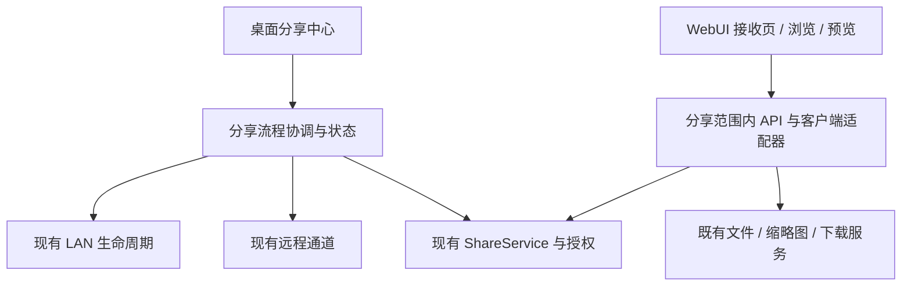

# WebUI 与桌面 ShareSystem 体验重写方案

> 2026-09-09。状态：已纳入首要开发主线；本轮完成代码盘点、产品范围与排期调整，尚未实施界面重写。
> 用户已确认：**局域网与异地链接分享同等优先；接收端首版聚焦浏览、预览、下载。**
> 排期唯一入口：[2026-09-14—09-20 周计划](weekly-priorities-2026-09-14.md)。旧顽疾实验暂停独立排期，根因仍开放。

## 1. 产品目标

发送者选好内容，在一个分享中心完成分享方式、启动和链接交付；接收者扫码或打开链接后，能立即理解分享了什么、进入目录、预览和下载。首次所需配置在同一流程完成，后续复用有效设置。

“一键快速配置”定义为：选定内容与分享方式后，点击一次主要操作，由应用执行检查、启动、必要配置和链接生成；只有环境确实缺少依赖或授权时才呈现明确的补齐步骤。再次使用不要求重填同一套配置。不以生成 URL 代替另一设备实际能够访问。

重写范围包括桌面分享信息架构、配置交互、状态呈现，以及 WebUI 访客入口、内容浏览和预览下载页面。采用分批替换：首批交付两种分享方式共用的新接收体验；后续把 WebUI 其余浏览页面迁入统一结构。每批都有可运行结果。

## 2. 当前代码中已确认的体验问题

本节基于源码检查和用户实际反馈，不声称本轮已经完成真机走查。

| 现状证据 | 对任务的影响 | 改造方向 |
|---|---|---|
| App.tsx:119–131 分别进入 /、/gallery、/browse、/s/:shareId；LandingPage.tsx:494–507 要求选择画廊/工作台 | 接收者需先理解产品的模式划分 | 分享直达内容；管理入口不占据访客主导航 |
| LandingPage.tsx 包含图片墙、背景调节和动效状态 | 首次访问的信息层级更偏展示，内容操作另有入口 | 分享首页先显示内容与操作；装饰服从内容 |
| ShareReceivePage.tsx:187–206 按 path 展示，每项均为 Folder 图标；预览/下载是图标链接 | 接收页缺少清晰类型、内容导航和可见操作文字 | 文件/文件夹卡片、目录层级、显式预览/下载按钮 |
| ShareReceivePage.tsx:52–64 加载失败后仅 toast，96–100 用无 shareInfo 展示 not_found | 网络故障与不存在容易呈现相同后续状态 | 按服务端错误与网络状态区分失败，提供重试或联系发送者 |
| api/shares.ts 与 lan/api.py:294–305 有 info/verify/preview/download，未见分享目录 listing 接口 | 仅重写页面无法提供完整文件夹浏览 | 补分享授权范围内的目录浏览与条目投影合同 |
| routes/shares.py:388–395 预览限既有安全图片集合 | 页面不能给所有格式相同预览承诺 | 显式返回可预览能力；不支持时提供说明与下载 |
| sharing_settings_dialog.py 与 share_link_dialog.py 分别承担设置和链接交互 | 快速分享流程需要跨配置/运行/链接状态协调 | 分享中心承担一个任务的完整流程，高级配置下沉 |
| sharing_settings_dialog.py:800–802 的链接表复制固定拼接 http://本机IP:端口；其他入口已使用 status URL | 复制入口之间的地址语义不一致，不能保证复制的是所选互联网地址 | 统一交付地址解析器，按分享方式给链接、QR、列表复制提供同一结果 |
| widgets/lan_sharing.py:436–484 可在服务未运行时打开链接创建对话框 | 创建分享记录与服务可访问未成为一个闭环 | 协调启动与创建；草稿链接明确标未就绪 |

入口文件：[WebUI 路由](../../webui/src/App.tsx)、[首页](../../webui/src/pages/LandingPage.tsx)、[接收页](../../webui/src/pages/ShareReceivePage.tsx)、[分享 API](../../AssetsManager/lan/routes/shares.py)、[分享设置](../../AssetsManager/dialogs/sharing_settings_dialog.py)。桌面执行线另核对各入口实际跳转，补入实现前的流程图。

## 3. 桌面新“分享中心”

信息结构只有三层：**快速分享、正在分享、高级设置**。桌面菜单、状态栏和文件选择入口都进入同一个中心，并保留调用时的库与选择范围。

### 快速分享

| 区域 | 用户看到什么 | 默认行为 |
|---|---|---|
| 分享内容 | 已选文件/文件夹、数量和可展开清单 | 从选中内容带入；分享整个库需明确选择 |
| 分享方式 | “同一网络”“互联网链接”两个同级选项 | 两种方式都在首版交付，不把异地隐藏到高级页 |
| 接收者权限 | “可浏览、预览和下载”的摘要 | 首版访客不展示标签/评分/备注编辑 |
| 访问设置 | 有效期、访问限制的摘要和“修改” | 用明确的预设；配置方案必须兼容现有权限与安全预检 |
| 主要操作 | “开始分享” | 检查当前库 → 检查连接条件 → 启动需要的服务 → 创建分享 → 展示结果 |

正常路径不要求用户输入端口、网卡、监听地址、证书或隧道参数。自动选项的失败必须给出当前原因及可执行修复入口；高级页仍能手动覆盖，并解释配置的生效范围。

### 正在分享

分享中心显示内容摘要、分享方式、链接/二维码、有效期、访问说明、接收端连接状态，以及“复制分享信息”“用浏览器检查”“停止此分享”。生成、失效、撤销后的链接/二维码同步更新。

“停止此分享”撤销当前分享；“停止全部共享”单独表达服务级操作。保留其他活动分享的归属，不因撤销一个链接误停整个 LAN 服务或隧道。

连接反馈分层表达：本机服务已启动、链接已生成、接收设备已连接。没有来自接收端或独立网络的证据时，不能把外网标为“连接已验证”。网络不可达时应用不能凭猜测判断防火墙、路由器隔离或接收方断网，采用诊断结果与未知状态。

## 4. 两种分享流程同等交付

### 同一网络

选择内容 → 选择“同一网络” → 开始分享 → 展示可用地址与二维码 → 手机扫码 → 必要的访问验证 → 内容列表 → 预览/下载。

自动选择合适地址并检验本机绑定/服务状态。二维码不能包含仅本机可达的 loopback 地址。多网卡或地址不明确时，显示建议地址与可理解的选择；检测端口占用时优先引导或采用可用配置。系统授权步骤在需要时出现，不静默修改防火墙策略。

### 互联网链接

选择内容 → 选择“互联网链接” → 开始分享 → 检查/准备现有远程通道 → 完成必要的首次设置 → 获得链接 → 接收者从另一网络打开 → 同一个内容列表与预览/下载体验。

优先复用项目已有远程通道能力；第一版不更换基础提供方。缺依赖、凭据或通道失败时，在分享中心内说明具体需要补齐什么，保留已选内容与访问设置，支持完成后继续。仅本机可以访问的 URL 不能作为异地分享成功。

临时地址变化、桌面服务关闭、隧道失联都要体现在当前分享状态。支持“重新生成/复制更新链接”；如果既有通道不能保证旧链接长期有效，应向发送者明确显示有效条件。

**现有实现约束**：lan/manager.py:279–321 要求服务正在运行且 auth_status 确认服务级认证已启用，才允许启动远程通道；设置页按需准备 cloudflared，首次可能遇到下载或启动失败。单个分享链接的访问码不等价于服务级认证。配置协调器须分别处理这两个合同，不能靠给链接加密码冒充预检通过，也不能为一键配置关闭认证。保留既有凭据和其他活动分享；需要改变服务级配置时先在操作摘要中解释影响，不静默重启他人正在使用的服务。

## 5. WebUI 新接收体验

### 页面结构

| 页面 | 首屏内容 | 主要操作 |
|---|---|---|
| 分享内容页 | 分享标题、内容数量、有效状态、文件/文件夹列表 | 点开文件夹；点开可预览文件；下载 |
| 文件夹 | 返回上级、当前位置、条目与分页/加载状态 | 浏览下级、预览、单项下载；批量下载在服务合同支持后开放 |
| 预览页 | 文件名、正文、可返回的来源位置 | 下载、关闭/返回、支持时切换前后文件 |
| 访问验证 | 分享名称的安全摘要、访问码输入、明确错误 | 验证后回到原来的内容位置 |
| 无法访问 | 按事实区分网络异常、失效/撤销、错误访问码、权限或额度限制 | 重试、重新输入、联系发送者等对应动作 |

目录浏览、预览和下载都使用当前分享授权范围；复用已有浏览组件时替换数据适配器，不能把访客导到全库 /browse 来取得目录能力。不同分享的 cookie/token、缓存、路径和回退导航相互隔离。

### 交互准则

- 手机优先，但桌面浏览器同样完整；375px 起不横向溢出，主要触控区域至少 44px，图标操作配明确名称。
- 主要动作一直可发现；进入预览后返回保留目录、滚动和选择状态，浏览器后退与界面返回一致。
- 文件类型有区别；超长中文名、无缩略图、空目录、损坏预览和加载中各有对应状态。
- 单文件下载使用与服务合同一致的方式；无法观察浏览器保存完成时只写“已交给浏览器下载”，不伪造完成进度。
- 网络错误不归类为链接不存在；刷新失败保留仍可展示的状态，并明确实时性/可用性。
- 使用项目现有语义颜色、字体与图标体系，分别验证浅色/深色、键盘焦点、文字放大和减少动态效果。

ui-ux-pro-max 用于交互审查：优先级采用内容层级、渐进展示、触控操作和失败恢复；具体实现仍使用项目的 React/PySide6 技术栈。

## 6. 实现边界

新增协调层只负责用户任务顺序、取消、错误与结果投影，业务权限继续由现有服务执行。启动被取消/失败时，仅撤销本次创建的资源；重复点击不重复创建分享或通道，不破坏先前运行的共享。

交付地址解析器需区分 LAN endpoint、public endpoint 与本机管理入口，返回地址来源、有效状态及必要访问条件；新建链接、现有链接复制、二维码和状态栏从这一结果取值。不能把已有 URL 修正只做到某一个按钮。优先扩展现有 LanControlPort、ShareSettingsPort 等边界，UI 不新增对 _impl/_port 等私有字段的依赖。

必要 API 增量先定义合同：分享目录的相对路径、条目类型、显示名、大小、预览能力、分页，以及失效/权限/网络错误分类。各请求重新校验 share scope，保护撤销后的浏览、预览与下载；沿用安全路径解析和资源所有权规则。准确路由/DTO 名称由适配线在实现前确定。

当前 Runtime 字段、ConnectionStatusBanner 和分享 URL 修正纳入新主线，避免另起一套连接状态与地址拼接逻辑。管理工作台、用户管理、元数据编辑和已有链接保持兼容；新访客壳不暴露不需要的管理复杂度。

## 7. 分阶段交付

| 阶段 | 目标 | 出口 |
|---|---|---|
| A：下周前半 | 当前流程盘点；桌面与手机可交互原型；状态/API 合同；局域网和互联网同等审查 | 两条流程能从开始走到结果，包含首次配置和失败恢复 |
| B：下周后半，40h 内首批 | 分享中心与新接收页形成最小可运行链路；两种连接方式共用体验 | 已配置环境中的局域网/异地均可浏览、图片预览、单文件下载；首次环境缺项可继续配置而非丢失上下文 |
| C：首批验收后 | 补齐首次配置自动化、更多媒体与目录批量下载、剩余 WebUI 页面一致性 | 当前两条路径的缺口逐一关闭，再扩展能力 |

一周承诺的是首批可运行交付与真实缺口清单，完整界面迁移按验收结果继续排期。两种分享方式同时占有实现和验收份额；依赖环境阻断某一路时明确标记，不把另一路成功当整体完成。

## 8. 验收用实际使用任务驱动

| 编号 | 场景 | 必须观察的结果 |
|---|---|---|
| U1 | 从选中内容开启同网分享，手机扫码 | 看到正确范围，能进入目录、预览与下载；无需理解画廊/工作台 |
| U2 | 互联网分享，接收设备切到另一网络 | 链接可达且使用同一接收体验；不能用本机自测替代 |
| U3 | 首次缺少远程依赖或配置 | 同流程说明、补齐后继续；重试保留选择，不生成假成功链接 |
| U4 | 多网卡/端口冲突/服务未启动 | 原因和操作明确；展示的 QR 与实际可用地址一致 |
| U5 | 错误访问码、撤销、过期、网络中断 | 可区分且可恢复；未授权不会展示分享外内容 |
| U6 | 手机浏览目录→预览→返回 | 目录与滚动位置保留，按钮易点，无横向溢出 |
| U7 | 中文长名、大文件、不支持的预览格式 | 名称可识别、错误解释清楚，下载内容可核对 |
| U8 | 开始分享重复点击、取消、停止一条分享 | 状态幂等，不误停其他分享；资源归属可追溯 |
| U9 | 分享期间隐藏/恢复桌面，下载中退出 | 状态符合产品合同，资源回收与数据持久化不回退 |

U1/U2 必须分别有真实跨设备/跨网络记录。自动化手机视口只验证布局，不能冒充手机扫码或异地连通性。可用设备不具备时写未测，保留手工步骤，不能标全量完成。

在可达、依赖已齐备的环境记录“点击开始到链接准备”“接收页打开到首项可操作”的时间，区分启动、通道建立、接口与渲染耗时；先建立实测目标，不能靠隐藏等待提升表面成绩。

## 9. 非本轮扩展项与旧任务取舍

独立 G3 前台注入、G2 防御修复、完整 LAN 容量扩展暂缓；历史退出根因仍记录为已知限制。恢复、权限、下载取消及必要退出回归作为主线门槛继续执行。

WebUI 元数据协作、完整后台 Job 平台、多提供方隧道、Framework 迁移及大规模服务重构不占首批预算。只有双场景流程需要的最小服务/API 改动随重写实施。

本计划不创建外网暴露、云资源或未来自动任务；这些操作发生在实际执行相应功能时。本轮只调整工作计划与设计范围，未修改生产 UI。
