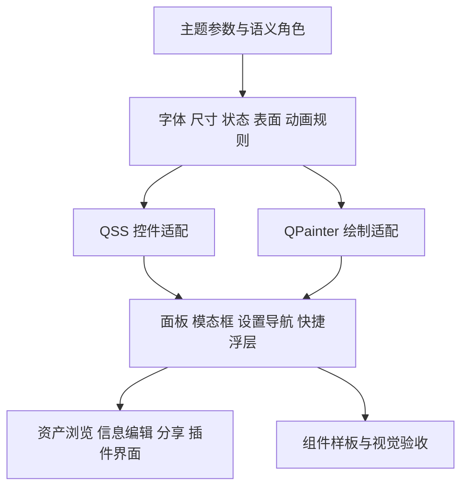

# 桌面端视觉一致性审阅与优化方案

> 状态：**DATED REVIEW + PROPOSAL（代码审阅快照与待实施方案）**  
> 日期：2026-09-05；对象：AssetManager 的 PySide6 桌面端。  
> 基线：工作区 HEAD `b2fb5fbd550844a6a04fbd9523e981f6e538d774` **加现有未提交修改**，不能只用该提交复现。逐文件 SHA-256 见[证据清单](desktop-visual-consistency-2026-09-05-evidence/manifest.json)。  
> 本次交付：源码审阅、静态检查、组件覆盖清单和优化规划；没有修改产品代码，没有启动真实桌面进行截图验收，也没有运行桌面测试套件。文中方案尚未实施。

## 1. 结论与阅读方式

桌面端已经拥有主题参数、通用样式工具、统一面板和弹窗基类。本轮应在这些基础上完成**组件规则与呈现结果的一致性**，优先处理同一控件在不同位置使用不同字体单位、状态样式、尺寸和刷新方式的问题。

本次最值得优先推进的五项工作：

1. 明确文字尺寸单位，让普通 Qt 控件与自绘文字使用同一角色定义。
2. 收敛输入框、按钮、表格等基础控件的重复样式规则。
3. 补齐分享设置的按钮栏例外、快捷浮层的公共外壳与刷新契约。
4. 修正网格中导入时就固定的缩放数值，形成一致的运行时缩放机制。
5. 建立包含真实业务组件的视觉样板及截图验收，补足现有静态门禁的边界。

当前没有证据支持“全桌面配色普遍不合格”或“所有组件都需要重写”。24 套内置主题的四组常用文字配色，在本次不透明色值计算中全部达到 4.5:1；现有四项样式/文案检查也均通过。后文分别标注代码事实、推断风险和设计建议。

建议阅读：产品讨论先看第 3、6、8 节；开发定位看第 4、5、7 节；验收看第 9 节。

## 2. 范围、方法与证据边界

### 2.1 覆盖范围

覆盖主窗口、启动窗口、停靠面板、文件浏览、信息编辑、所有桌面弹窗目录、可复用控件、自绘视图、背景效果、主题/图标/缩放基础设施，以及随仓库提供的插件面板。

源文件扫描范围包括：

- `AssetsManager/panels/`、`widgets/`、`dialogs/`、`background/`。
- `app.py`、`window.py`、`window_coordinator.py`、`dock_factory.py`。
- `core/themes.py`、`theme_loader.py`、`icons.py`、`ui_scale.py`、`color_utils.py`、`signal_bus.py`。
- `plugin_api/` 与 `Plugins/Addons/`；内置主题 JSON。
- 与视觉相关的现有检查脚本及代表性桌面测试，作为验证能力评估输入。

不纳入本次改造范围：WebUI、LAN 接口和认证规则、数据库结构、文件操作与撤销业务规则。分享设置的**桌面界面**属于本次范围。

### 2.2 方法与实测规模

采用“全范围语法树扫描 → 按组件族阅读构造与样式 → 追踪主题/缩放/语言刷新 → 对照旧文档及测试”的方式。并非逐行人工审计全部业务逻辑。

| 指标 | 本次结果 | 解释 |
|---|---:|---|
| Python 源文件 | 112 | 包含后台辅助、协议和数据类；不是 112 个可见组件 |
| 源码行数 | 39,739 | 包含空行与注释，按 `splitlines()` 统计 |
| `setStyleSheet` 调用 | 234 | 分布位置指标，不能当作缺陷数 |
| `paintEvent` 定义 | 10 | 不含以其他方法名实现的委托绘制 |
| 固定宽/高/尺寸设置 | 69 | 固定尺寸在图标等场景合理，需结合语义判断 |
| `setDuration` 调用 | 14 | 包含已有统一时长调用和距离相关动画 |
| 内置主题 | 24 | 深色 13、浅色 11；按 JSON 的 `dark` 字段统计 |

完整逐文件类名、继承关系和上述指标见[源文件清单 CSV](desktop-visual-consistency-2026-09-05-evidence/source-inventory.csv)；具体调用及行号见[源码采样 JSON](desktop-visual-consistency-2026-09-05-evidence/occurrences.json)。

证据标签：

- **已确认**：源码存在明确差异，或本次命令得到明确结果。
- **待实机确认**：代码存在触发条件，但未测量实际界面中的严重程度。
- **建议**：后续设计选择，不代表当前功能有错误。

文中行号对应本次工作区快照；后续修改后应重新定位。旧评审只用于发现线索，不作为当前缺陷的直接证据。

## 3. 桌面视觉组件地图

下表按用户看到的区域组织。辅助类和业务类见 CSV，不重复计为可见组件。

| 组件族 | 当前界面/组件 | 主要实现入口 | 本轮统一重点 |
|---|---|---|---|
| 应用外壳 | 主菜单、工作区位置、分享按钮、状态栏 | [window.py](../../AssetsManager/window.py)、[window_coordinator.py](../../AssetsManager/window_coordinator.py) | 顶部密度、图标热区、状态提示、全局刷新 |
| 启动页 | 最近库卡片、库详情、首次使用卡片 | [startup.py](../../AssetsManager/dialogs/startup.py) | 卡片、标题、空态和操作按钮；保留启动页的信息层级 |
| 停靠容器 | 面板标题、浮动、关闭、扩展按钮、底栏 | [dock_factory.py](../../AssetsManager/dock_factory.py) | 同一标题栏契约、间距、按钮尺寸和焦点 |
| 面板骨架 | `PanelContent`、`StandardPanel` | [base.py](../../AssetsManager/panels/base.py) | 标题/工具/内容/状态的组合规范；允许业务面板有不同布局 |
| 工作区标签 | 库标签、增加、关闭、重命名、选中指示 | [workspace_bar.py](../../AssetsManager/widgets/workspace_bar.py) | 与内容内标签区分层级，统一状态与文字基线 |
| 嵌套标签容器 | `TabContainer` | [tab_container.py](../../AssetsManager/widgets/tab_container.py) | 与工作区、微型分段控件分清用途；确认实际挂载场景 |
| 左侧导航 | 目录树、收藏、最近目录、资产集合、过滤框 | [sidebar.py](../../AssetsManager/panels/sidebar.py)、[_sidebar_parts.py](../../AssetsManager/panels/_sidebar_parts.py) | 行高、层级缩进、选中/展开/空态、底部统计 |
| 标签导航 | 标签树、搜索、管理入口 | [tag_tree.py](../../AssetsManager/panels/tag_tree.py)、[tag_browser_dialog.py](../../AssetsManager/dialogs/tag_browser_dialog.py) | 与目录树共享基础行样式，保留标签颜色语义 |
| 浏览工具区 | 导航、面包屑、搜索、过滤、排序、视图、缩放 | [_base_layout.py](../../AssetsManager/panels/file_list/_base_layout.py)、[_navigation.py](../../AssetsManager/panels/file_list/_navigation.py) | 控件高度、分组间距、窄窗口溢出、筛选激活状态 |
| 高级筛选浮窗 | 日期、大小、评分、扩展名、应用/清除 | [_base_layout.py](../../AssetsManager/panels/file_list/_base_layout.py) | 紧凑表单规范、标签对齐、焦点与按钮语义 |
| 资产网格 | 卡片、文件夹、名称、副信息、类型角标、选中、失败标记 | [_grid_widget_render.py](../../AssetsManager/panels/file_list/_grid_widget_render.py)、[_grid_widget_interact.py](../../AssetsManager/panels/file_list/_grid_widget_interact.py) | 自绘文字、边框、缩放、hover/selected/focus 分离 |
| 详细列表 | 表头、行、图标、排序、选择 | [_detail_model.py](../../AssetsManager/panels/file_list/_detail_model.py)、[_ui_helpers.py](../../AssetsManager/panels/file_list/_ui_helpers.py) | 与网格和管理表格共享状态语义，允许密度不同 |
| 浏览反馈 | 缩略图占位、失败、空目录、无搜索结果、操作状态 | [_thumbnail_delivery.py](../../AssetsManager/panels/file_list/_thumbnail_delivery.py)、[_base_events.py](../../AssetsManager/panels/file_list/_base_events.py) | 状态可区分、减少异步内容跳动、保持批量刷新 |
| 信息面板 | 预览、信息/标签/备注分段、评分、链接、插件字段 | [info.py](../../AssetsManager/panels/info.py)、[_info_parts.py](../../AssetsManager/panels/_info_parts.py) | 字号、卡片材质、表单标签、段间距、异步占位 |
| 分段切换 | `MicroTabBar` | [micro_tab_bar.py](../../AssetsManager/widgets/micro_tab_bar.py) | 内容内切换标准，与工作区标签保持不同用途 |
| 标签胶囊 | 文字、颜色、移除按钮、hover/focus | [tag_chip.py](../../AssetsManager/widgets/tag_chip.py) | 编辑/只读模式、关闭热区、用户颜色的前景对比 |
| 主色条 | 提取色块、提示、点击 | [dominant_palette_strip.py](../../AssetsManager/widgets/dominant_palette_strip.py) | 色块是资产数据，不随主题重配色；外壳与焦点统一 |
| 快速预览 | 图片/视频/通用文件卡、前后切换、关闭 | [quick_look_overlay.py](../../AssetsManager/widgets/quick_look_overlay.py) | 浮层外壳、遮罩、边距、屏幕约束、刷新 |
| 图片查看器 | 主图、关闭、缩略图条、EXIF、序列/播放状态 | [image_viewer.py](../../AssetsManager/panels/image_viewer.py) | 预览工具栏、自绘文字、材质和焦点；保留沉浸式画布 |
| 命令面板 | 搜索框、分组、命令行、快捷键提示 | [command_palette.py](../../AssetsManager/widgets/command_palette.py) | 文字角色、结果行、辅助文案、多语言和浮层契约 |
| 快捷打标 | 标题、计数、目标文件、标签、输入、关闭 | [quick_tagger_overlay.py](../../AssetsManager/widgets/quick_tagger_overlay.py) | 与快捷预览共享外壳，保持其即时编辑语义 |
| 普通模态框 | 标题、说明、正文、取消/应用/确认 | [modal_dialog.py](../../AssetsManager/dialogs/modal_dialog.py)、[tabbed_dialog.py](../../AssetsManager/dialogs/tabbed_dialog.py) | 现有基类继续作为标准，补齐绕过基类的例外 |
| 设置中心 | 外观、通用、缩略图、维护、备份、插件 | [settings_dialog.py](../../AssetsManager/dialogs/settings_dialog.py) | 导航壳、分组、表单、进度/结果、即时生效说明 |
| 分享设置中心 | 访问地址、分享链接、访问管理、配置及管理表格 | [sharing_settings_dialog.py](../../AssetsManager/dialogs/sharing_settings_dialog.py)、[sharing_settings/](../../AssetsManager/dialogs/sharing_settings/) | 共享设置导航与按钮栏；不改变访问控制规则 |
| 分享小窗 | 创建链接、二维码 | [share_link_dialog.py](../../AssetsManager/dialogs/share_link_dialog.py)、[share_qr_dialog.py](../../AssetsManager/dialogs/share_qr_dialog.py) | 密码/期限表单、复制反馈、二维码中性色背景与留白 |
| 标签编辑小窗 | 标签管理、标签样式、取色 | [tag_editor_dialog.py](../../AssetsManager/dialogs/tag_editor_dialog.py)、[tag_style_dialog.py](../../AssetsManager/dialogs/tag_style_dialog.py)、[color_picker_dialog.py](../../AssetsManager/dialogs/color_picker_dialog.py) | 列表、表单、颜色预览、底栏统一 |
| 其他编辑小窗 | 批量重命名、目录设置、无设置提示、插件参数 | [_batch_rename_dialog.py](../../AssetsManager/panels/file_list/_batch_rename_dialog.py)、[sidebar_settings_dialog.py](../../AssetsManager/dialogs/sidebar_settings_dialog.py)、[generic_settings_dialog.py](../../AssetsManager/dialogs/generic_settings_dialog.py)、[plugin_operator_dialog.py](../../AssetsManager/dialogs/plugin_operator_dialog.py) | 复用标准模态框；保留操作确认和预览信息 |
| 历史与活动 | 撤销记录、活动日志、筛选和操作 | [undo_panel.py](../../AssetsManager/dialogs/undo_panel.py)、[activity_panel.py](../../AssetsManager/dialogs/activity_panel.py) | 记录行、时间、状态、危险操作与空态 |
| 插件管理 | 插件卡片、详情、开关、设置 | [_plugin_manager_widget.py](../../AssetsManager/dialogs/_plugin_manager_widget.py)、[plugin_manager_dialog.py](../../AssetsManager/dialogs/plugin_manager_dialog.py)、[plugin_ui.py](../../AssetsManager/widgets/plugin_ui.py) | 卡片/开关/详情规范，设置内嵌版与独立版一致 |
| 插件内容 | 下载历史插件面板；其他宿主贡献入口 | [tracker.py](../../Plugins/Addons/download_tracker/tracker.py)、[types.py](../../AssetsManager/plugin_api/types.py) | 统一宿主容器、提供插件可用控件；不假定外部插件完全可控 |
| 空状态与轻提示 | `EmptyStateWidget`、`EmptyPanel`、Toast | [empty_state.py](../../AssetsManager/widgets/empty_state.py)、[empty.py](../../AssetsManager/panels/empty.py)、[toast.py](../../AssetsManager/widgets/toast.py) | 图标、文字、操作、状态颜色；错误不能只靠颜色 |
| 长任务提示 | 导入、备份、恢复的进度窗 | [window.py](../../AssetsManager/window.py)、[_maintenance_tasks.py](../../AssetsManager/dialogs/_maintenance_tasks.py) | 同一进度外观，但可取消与不可取消必须明确区分 |
| 系统交互 | 托盘图标/菜单、消息框、文件选择器、提示气泡 | [tray.py](../../AssetsManager/widgets/tray.py)、各调用方 | 宿主可控部分统一；系统原生文件选择器可保留平台外观 |
| 颜色工具与样板 | HSV 色轮、亮度滑条、主题样板/预览窗 | [hsv_wheel.py](../../AssetsManager/widgets/hsv_wheel.py)、[theme_preview.py](../../AssetsManager/widgets/theme_preview.py)、[theme_preview_dialog.py](../../AssetsManager/dialogs/theme_preview_dialog.py) | 保留色彩工具的必要色谱；扩充真实组件样板 |
| 背景效果 | 图片、透明度、CPU/GL 效果管线 | [background/](../../AssetsManager/background/)、[window.py](../../AssetsManager/window.py) | 表面层级、可读性、缓存、效果回退与主题独立性 |
| 基础视觉资源 | 主题、图标、字体、缩放、阴影、样式工厂 | [themes.py](../../AssetsManager/core/themes.py)、[icons.py](../../AssetsManager/core/icons.py)、[stylekit.py](../../AssetsManager/widgets/stylekit.py)、[elevation.py](../../AssetsManager/widgets/elevation.py) | 最终规则的唯一来源和兼容入口 |

说明：目录收藏/最近项的数据存储类，以及扫描、解码、后台任务类，只审阅与可见状态的连接，不把它们误列为需要重新设计的控件。

## 4. 已存在的统一基础：应保留并补齐

| 当前机制 | 本次确认 | 后续处理 |
|---|---|---|
| 颜色、字体、间距、圆角、图标尺寸等主题入口 | `themes.color/prop/font_size/metrics` 已存在 | 沿用；明确角色、单位和覆盖规则 |
| 四类按钮语义 | `primary / secondary / ghost / danger` 已实现 | 收敛其呈现规则，避免不同工厂再次解释语义 |
| 通用面板和模态框 | Sidebar/TagTree 使用 `StandardPanel`；多类编辑窗使用 `StandardModalDialog` | 不要求中央画布等特殊面板强行改继承关系 |
| 对话框按钮顺序 | `_DialogButtonBar` 和 `StandardModalDialog` 已采用取消→应用→确认 | 剩余分享设置例外见 V03 |
| 两个设置中心的导航范式 | 均已使用左导航＋内容栈，并在窄窗口转顶部导航 | 已是同一范式，但仍有两份实现，见 V09 |
| 动画时长 | `themes.motion()` 已有 micro/fast/normal/slow 四档 | 继续收敛剩余字面量和减弱动态效果开关 |
| 阴影 | 通用 elevation，网格 hover 已调用 `shadow_params(1)` | 不再声称网格阴影完全独立；需验证两种渲染结果 |
| 网格底色 | 原渐变已改为平坦淡色 | 不重复安排“删除渐变”；继续审核内容中性与透明素材背景 |
| 动态刷新 | `TabbedDialog.supports_runtime_refresh=True` 默认启用 | 子类正文重译仍需实现，直接继承 QDialog 的浮层另查 |
| 空态和通知 | 已有 EmptyStateWidget、Toast，包含部分可访问性能力 | 优先复用；不再发明同用途的新外壳 |

与[09-03 设计语言方案](../plans/design-language-unification-2026-09-03.md)的关系：该文的若干任务已有代码落地。其“设置仍为两套导航范式”“所有按钮栏顺序相反”“网格仍用旧渐变”等描述不能整体沿用。是否所有旧任务均已完成，本报告不作承诺。

## 5. 当前差异与可执行任务

优先级用于实施顺序：**P1** 为基础规则或高频一致性问题，**P2** 为复用与覆盖完善。此处不是安全漏洞等级；本次不制造缺少实机证据的紧急问题。

### V01 · 字体单位与文字角色没有统一到底（P1，已确认）

**证据**：`themes.py:351` 将字体 token 描述为 points；`StyleKit.label_css` 在 `stylekit.py:178` 将缩放后的字号输出为 `px`。`command_palette.py:88,169,187` 则将语义字号传给 `QFont.setPointSize`。同一 `caption` 角色在 `tag_chip.py:96` 附近输出为 QSS 像素字号。

此外，网格名称/副信息直接使用 9/8 pt（`_grid_widget.py:112,116`，`_grid_widget_data.py:82,86,89`），图片查看器也有多处直接指定点数。它们可能与当前默认主题碰巧接近，但不能统一响应主题字号角色变更。

**影响**：相同名称的字号不具有同一单位；字体、行高、截断和对齐存在漂移条件。实际差异需在目标 DPI 下测量，不能仅凭数值认定屏幕上固定差多少像素。Qt 分别定义点字号与像素字号，转换应遵循设备与字体机制。[Qt QFont 文档](https://doc.qt.io/qt-6/qfont.html)

**任务**：先决定文字角色的规范单位，并建立 QSS/QFont 两个适配入口；用当前界面样本校准，逐组件迁移。不要直接把所有 `px` 替换成 `pt`，也不要把手写 8/9 机械替换成同数字 token。

**验收**：相同角色在标签、列表、自绘行、对话框中得到等效字体度量；中英日字符无裁切，窗口内原有信息密度保持可用。

### V02 · 普通控件的状态样式仍有两份定义（P1，已确认）

**证据**：全局输入框焦点边框在 `themes.py:728` 为 1px；对话框工厂在 `stylekit.py:247` 附近为 2px。全局禁用按钮使用 `disabled_bg/disabled_text`（`themes.py:816`），`StyleKit.button_css` 在 `stylekit.py:449` 附近使用 muted 的透明派生色。滚动条等也分别在全局、对话框、自绘视图中定义。

**影响**：同样是输入框或禁用按钮，仅由于父容器不同就可能改变强调程度。焦点边框是否引起内容跳动需截图/几何断言确认。

**任务**：将输入框、按钮、选择行、表格、滚动条的状态配方提取为共享规则，由全局 QSS 和局部工厂调用；保留有名称的紧凑/标准变体。

**验收**：同一主题下比较主界面、设置、分享设置中的 idle/hover/focus/pressed/disabled，只有明示变体可以不同；焦点出现不改变文字可用区。

### V03 · 分享设置仍绕过统一按钮栏（P1，已确认）

**证据**：`tabbed_dialog.py:80` 的 `_DialogButtonBar` 明确固定取消→应用→确认；`modal_dialog.py:116–135` 同序。但 `sharing_settings_dialog.py:184` 仍创建原生 `QDialogButtonBox`，其实际按钮排序由平台样式参与决定。本次在 panels/widgets/dialogs 的构造调用检索中，这是剩余的一处直接构造。

**任务**：分享设置接入公共按钮栏，继续绑定原有应用、确认和拒绝回调。不要在迁移中改变保存时机或丢弃未应用设置的处理。

**验收**：在 Windows 上记录按钮从左到右顺序、默认按钮、Enter/Esc 行为；和标准模态框一致。具体当前屏幕顺序仍待实机截图确认。

### V04 · 自绘网格的一部分缩放值在模块导入时固定（P1，已确认）

**证据**：`_grid_widget_render.py:43–49` 在模块级计算圆角、预览圆角和角标尺寸；`_grid_widget_data.py:33–36` 同样计算卡片边距、预览边距和文字间隙。后续 `_refresh_text_metrics()` 会重新计算字体，但上述模块常量不会随设置变化重新求值。

**影响**：运行时改变 UI 缩放后，部分尺寸更新，部分仍保留导入时的值。`_CORNER_R` 还直接固定为 10，无法表达不同主题的组件圆角选择。

**任务**：将未缩放的设计值和运行时度量分开；按当前 theme/ui_scale/DPR 构建组件度量，并让布局、绘制和纹理缓存使用同一版本。Qt 高 DPI 的设备像素比与应用内 UI 缩放应分别处理，避免重复放大。[Qt High DPI 文档](https://doc.qt.io/qt-6/highdpi.html)

**验收**：1.0→1.5→1.0 往返后，卡片内外边距、圆角、角标和文字布局恢复；窗口跨不同 DPI 屏幕后没有旧纹理或点击区域错位。

### V05 · 快捷浮层缺少共同的外壳与运行时刷新契约（P1，代码差异已确认，影响待实机确认）

**证据**：CommandPalette、QuickLookOverlay、QuickTaggerOverlay 直接继承 QDialog；构造时各自设置本地 QSS，未接入 TabbedDialog 的主题/语言/UI 缩放订阅。QuickLook 的遮罩为主题 base＋alpha175（`:566`），QuickTagger 为 base＋alpha170（`:261` 附近），ImageViewer 则为固定黑色＋alpha180（`:856`）。

QuickTagger 卡片固定宽 `scaled_px(440)`（`:87`），CommandPalette 为 `scaled_px(560)`（`:230` 附近）；这些尺寸未形成统一的可用屏幕约束规则。

**任务**：建立轻量的浮层外壳，统一定位、屏幕边界、遮罩语义、关闭按钮、阴影、焦点进入/归还与刷新清理；内容区保持独立。图片查看器可以保留专用中性暗色幕布，但应显式命名为媒体预览变体。

**验收**：通过测试触发主题/语言/缩放变化后，外壳、正文、图标和自绘区域同时更新；在小窗口、长标签、多选和大缩放下可访问全部操作。普通使用中是否允许在浮层打开时改变设置，以实际交互路径为准，不假设所有模态窗可并行操作。

### V06 · 控件尺寸与缩放零值规则仍有例外（P2，已确认）

**证据**：已有 `metrics('hit_area')=24`、`control_height_md=28`、标准图标 12/16/20/24；QuickTagger 关闭按钮仍手写 22×22、图标12（`:148–150`）。`ui_scale.py:24` 的 `scaled_px` 最小返回 1；`elevation.py:50` 附近将它用于本应为 0 的阴影水平偏移，因此零偏移也变成 1。

**任务**：区分“图形尺寸”“交互热区”“控件高度”；明确桌面紧凑和标准密度。对间距、偏移、零边距提供能保留 0 的入口，不直接修改全局 helper 而忽略其他调用方的最小值依赖。

**验收**：同语义图标按钮热区一致；0 偏移仍为 0；大缩放不裁字。桌面鼠标界面不机械套用移动端 44/48 的所有控件尺寸。

### V07 · 动画已集中，但启动例外仍绕过减弱动态效果（P1，已确认）

**证据**：`window.py:286–299` 的首次显示无条件创建 300ms 淡入，没有检查 reduce_motion；TabbedDialog 在 `:290` 附近已检查 `StyleKit.reduce_motion()`。主窗口主题过渡还使用 100/200ms 字面量（`window_coordinator.py:138,148`），其他多数调用已使用 `themes.motion()`。

**任务**：统一固定时长和动画启停入口；启动淡入遵循同一设置。滚动/缩放按距离计算的动画保留其算法，不强塞固定时间。检查正在播放时改变设置后的收尾状态。

**验收**：开启 reduce_motion 时无窗口淡入和装饰动画；关闭时遵循现有四档节奏；中断后窗口完全不透明，指示器停在正确位置。

### V08 · 色值通过检查，不代表叠加后的材质已验证（P2，已确认配置差异，观感待确认）

**证据**：InfoPanel 的分组背景在 `info.py:428` 附近为 panel 的 0.45 透明度；网格底色在 `_grid_widget_render.py:495` 附近从 heading 取 alpha6，边框 alpha24；查看器、快捷浮层各有局部材质。图片背景和面板透明度也会改变最终显示背景。

24 套主题的 96 组不透明配色样本全部≥4.5，但最低组接近阈值（Mint 的 muted/panel 约4.501）。这只证明被测 JSON 配对，不能证明透明叠加、禁用态、标签用户色、错误角标或壁纸场景全部合格。计算数据见[主题对比度记录](desktop-visual-consistency-2026-09-05-evidence/theme-contrast.json)。

**任务**：给工作区、内容卡、弹出层、媒体画布定义表面角色；把透明度和遮罩变体纳入规则。保留用户背景能力，为高对比图片背景提供稳定可读的内容承载面。

**验收**：浅/深主题分别与明亮、暗色、高细节背景组合检查。以普通文字4.5:1为项目可读性目标，必要时测量合成背景；这是借用 WCAG 的量化参考，并非宣布该原生应用通过整套 WCAG 合规认证。[W3C 对比度说明](https://www.w3.org/WAI/WCAG22/Understanding/contrast-minimum.html)

### V09 · 两个设置壳已同形，但维护上仍分叉（P2，已确认）

**证据**：`settings_dialog.py:77` 的 `_SettingsNavShell` 与 `sharing_settings_dialog.py:133` 的壳分别构造导航、按钮和内容栈；紧凑切换阈值分别为760与800（`:85`、`:244`）。相同结构的视觉调整需要双处同步。

**任务**：形成公共设置导航容器，允许根据页面数量/内容宽度传入有名称的配置。不同阈值本身不必判错，但要有可解释的规则，避免凭文件决定样式。

**验收**：两处同类导航按钮、选中样式、间距、焦点一致；窄布局下6页与4页标题都不溢出。已选页面及未保存输入不因布局切换丢失。

### V10 · 文案一致性仍有词典检查之外的缺口（P2，已确认）

**证据**：CommandPalette 在 `command_palette.py:381–521` 使用 `UI Theme / Preferences / Files / Maintenance` 等字面描述，并在 `:795` 写入可见描述角色。内置下载历史插件 `tracker.py:248` 附近使用英文空态 `No recorded downloads yet.`。

**任务**：将宿主和内置插件可见辅助文案纳入翻译；中文/日文模式中的说明语言、标点和大小写形成规范。路径、用户标签及文件名保持原始内容。第三方插件内容的语言能力应在宿主规范中说明。

**验收**：命令面板标题、说明、快捷键提示和空态在中英日三语下保持同一语言层级；长文案换行/省略策略明确。词典键对齐仅说明词典结构一致，不能发现未调用翻译函数的文案。

### V11 · 通用样板与当前测试不能替代整个桌面的视觉验收（P1，已确认覆盖边界）

**证据**：ThemePreviewWidget 当前列出按钮、输入、文字、列表、表格、对话框、勾选、滑条进度、分组等示例（`theme_preview.py:384` 附近），未包含真实资产网格、信息面板、命令面板和快捷打标组合。`test_stylekit_snapshots.py` 比较的是 QSS 文本；`test_theme_visual_smoke.py` 主要验证单色 QLabel 像素与主题往返；统一组件测试主要验证继承、属性和结构。

**任务**：扩展现有样板作为组件展示入口，另建固定样本的真实页面视觉夹具。静态检查继续负责源头约束，结构测试负责行为契约，截图负责实际组合效果，人工负责信息层级判断。

**验收**：第9节的主要表面与交互状态都有前后对照证据；不能仅以样式脚本全绿宣布全桌面视觉一致。

## 6. 建议采用的视觉规范

以下是本轮建议的设计契约，须在实施样板中定稿。沿用现有主题资产，不新增一套平行主题系统。

### 6.1 整体方向

目标为“内容优先、紧凑清晰、状态明确”。资产的颜色和预览保持主导；工具和面板使用稳定的层级、留白与控件形态。深浅模式都是正式支持场景。

视觉一致性指同语义组件遵循相同规则。启动页、工作区、颜色工具和沉浸式预览可以保留适合任务的布局差异。不要为了统一，让所有面板都增加相同数量的标题、边框或按钮。

### 6.2 基础规则

| 项目 | 建议规范 | 与现有实现关系 |
|---|---|---|
| 颜色 | 使用 base/panel/header、文字层级、accent、状态色及明确表面角色 | 沿用现有 token；新角色需要回退值以兼容用户主题 |
| 字体 | 定义界面标题、正文、辅助、资产名、资产副信息、角标、快捷键角色；每角色明确单位、字重、行高 | 先解决 V01，再决定数值；使用可覆盖中英日的系统字体回退 |
| 空间 | 优先沿用 spacing 档位；区分组件内距、组件间距、分组间距、弹窗外距 | 不把所有数值统一为同一间距 |
| 密度 | 紧凑/标准两个具名档位；以当前24热区、28控件高作为首轮校准基线 | 具体值待字体样板确认，不把24称作所有平台的无障碍标准 |
| 图标 | 同层级共用尺寸与线条风格，图标尺寸和热区分别指定 | 沿用 icons.py；资产类型图、用户颜色与产品资源图可有明确例外 |
| 边框 | idle与focus保留相同几何占位；焦点通过颜色或内侧绘制强调 | 区分逻辑像素边框与实际设备像素发丝线 |
| 圆角 | 定义输入、按钮、标签、资产卡、浮层的角色映射 | 从既有圆角档位取值，禁止在模块导入时固定缩放结果 |
| 阴影 | 常驻面板、轻浮层、模态浮层分级；媒体画布可无投影 | 沿用 elevation；自绘使用同语义参数而非强求同算法 |
| 表格/树 | 共用表头、悬停、选择、焦点、禁用语义；可设置不同密度 | 保留树的层级缩进与管理表格的信息密度 |
| 状态 | loading、empty、error、disabled、read-only 各有定义 | 使用 EmptyStateWidget/Toast/内联提示，避免同一错误多处重复弹出 |
| 动画 | 固定动画读 motion 档位，统一 reduce_motion；可中断、不阻塞操作 | 保留缩放与滚动的距离模型、批量重绘和缓存机制 |
| 运行时变化 | 主题、语言、UI缩放、屏幕DPR变化各有刷新与失效规则 | 清理订阅，避免重建控件导致输入、滚动、选择丢失 |

### 6.3 交互状态矩阵

| 组件 | 默认/悬停 | 选择/按下 | 键盘焦点 | 禁用/只读 | 反馈 |
|---|---|---|---|---|---|
| 按钮 | 根据四类 variant 显示 | 压下态不改变大小 | 清晰轮廓，与hover区分 | 禁用不响应；只读不是按钮状态 | 长操作可显示忙碌并说明结果 |
| 输入 | 有可见标签与稳定边框 | 文本选择使用统一色 | 占位不跳变 | 只读内容可读；禁用有明确原因 | 错误就近显示且有文案 |
| 树/列表/卡片 | hover为轻提示 | 选择保持，支持selected+hover | 焦点与选择可同时辨认 | 不可操作项不伪装可点击 | 加载失败区别于未加载 |
| 分段/标签导航 | 未选项为次级 | 当前项稳定突出 | 焦点独立于当前项 | 不可用项有语义说明 | 切换不丢上下文 |
| 标签胶囊 | 用户色或主题默认 | 编辑行为与只读明确 | 标签/移除操作可辨认 | 只读隐藏编辑操作 | 删除/增加后反馈保持布局稳定 |
| 浮层/弹窗 | 清晰层级与标题 | 主次操作固定位置 | 进入时定位、关闭后归还 | 忙碌时的可取消性真实 | 成功、失败、重试路径明确 |

### 6.4 弹窗与消息的组合规则

- 配置类：导航＋内容＋公共操作栏；说明即时生效与需应用的差异。
- 编辑确认类：标准模态框；取消→应用（可选）→确认，并保留明确动作名称。
- 快捷类：轻量浮层；共享外壳、焦点、关闭和屏幕约束，内容独立。
- 轻提示：Toast 不抢焦点；需要用户处理的问题保留可操作入口。
- 长任务：进度外观统一，但备份/恢复当前无合作取消，不应为了“按钮一致”加一个无法真正取消的按钮；导入保留可取消能力。
- 系统文件选择器允许原生外观。宿主负责标题、过滤条件、错误说明和返回后的反馈，避免单纯为外观重造系统窗口。

## 7. 实现组织建议

建议在现有基础上明确三层责任，不增加服务层对 Qt 的依赖。

建议演进位置：

1. `themes.py`：继续提供参数读取及兼容回退；不让各调用方重新解释角色。
2. `stylekit.py`：统一普通控件配方，避免再复制一份全局样式。是否拆分子模块由实现时规模决定。
3. `ui_scale.py` 与字体适配：明确逻辑尺寸、点字号、像素字号、DPR以及零值处理。
4. `PanelContent/StandardPanel`：统一状态与生命周期契约，特殊布局仍可自行装配。
5. `TabbedDialog/StandardModalDialog`：承载通用模态行为、样式和按钮栏。
6. 从 `_SettingsNavShell` 演进共享设置壳；从现有三个快捷浮层提取轻量公共外壳。
7. 网格保留模型、纹理缓存、批量缩略图交付；视觉规则变更通过明确缓存失效接入。
8. 插件先统一宿主容器和内置面板，向插件公开稳定的组件入口；第三方自行绘制内容以规范和样板引导。

新增视觉控件不应直接访问 SQLite、自行拼 RuntimeData 路径或新增跨模块的 MainWindow 私有字段依赖。切库和关闭必须沿用现有后台任务与订阅清理机制。

## 8. 分阶段实施与交付

| 阶段 | 工作包 | 主要目标/关联发现 | 可评审交付物 | 完成条件 |
|---|---|---|---|---|
| A 基线与规范 | 固定样本、组件样板、字体单位和状态规则 | V01/V02/V11 | 当前截图组、字体度量对照、规范草案 | 选定基线后再做全局迁移；保留原主题与布局 |
| B 基础控件 | 字体适配、输入/按钮/表格状态、零值与尺寸规则 | V01/V02/V06 | 同一控件跨容器对照页 | 主题/缩放往返、各状态和三语通过 |
| C 高频主界面 | 顶部、左右面板、网格、列表、标签、信息字段 | V04/V08 | 主窗口默认/浏览/检查模式对照 | 选择/滚动/缩放不回退，加载状态可辨认 |
| D 弹窗与浮层 | 分享按钮栏、两个设置壳、快捷浮层、辅助编辑窗 | V03/V05/V09 | 弹窗目录逐项前后图 | 屏幕约束、焦点、按钮顺序、保存语义通过 |
| E 补齐覆盖 | 启动页、插件、历史、通知、文案、减弱动态效果 | V07/V10 | 全组件覆盖清单及例外表 | 不存在未登记的宿主视觉例外 |
| F 验收与收口 | 真实场景、DPI、背景组合、性能回归、文档更新 | V11及全部发现 | 带版本与平台信息的验收记录 | 逐项接受或有明确延期原因；不以脚本通过替代截图 |

实施原则：每个阶段可单独评审和回退；先共享规则，再迁移调用方。涉及全局字体/样式时先用两三个代表性组件校准，避免一次改完整桌面后无法定位回归。

本报告不给缺少实际视觉基线的固定工期承诺。可按“主窗口组件族”“弹窗族”“浮层族”拆成独立开发批次。

## 9. 验收矩阵与现有检查的边界

### 9.1 本次已执行

环境：Windows 工作区，Python 3.14.3。以下命令退出码均为0；输出保存在同名证据文件。

| 命令 | 本次结果 | 能证明什么 |
|---|---|---|
| `python scripts/check_style_sources.py` | 94个范围文件，0项违规 | 脚本覆盖的QSS颜色、字体、尺寸规则未违规 |
| `python scripts/check_style_dialects.py` | 0个旧写法位置 | 当前语法匹配规则与账本一致，不代表没有局部变量或其他形式的重复样式 |
| `python scripts/check_inline_styles.py` | 39文件、232调用，未超过基线 | 样式调用数量未突破既有上限，不代表布局或视觉一致 |
| `python scripts/check_i18n_catalogs.py` | en/ja/zh各1035，版本均2 | 词典目录对齐，不代表所有可见文案均进入词典 |
| `python docs/reports/desktop-visual-consistency-2026-09-05-evidence/collect_evidence.py` | 112源码文件及24主题记录 | 静态清单、调用位置和原始色值配对；未实例化应用 |

本报告的234个QSS调用采用更广扫描范围，与样式门禁232个的统计边界不同，不应混用。

现有 StyleKit 快照、主题像素冒烟、组件基类、弹窗刷新、网格可访问性等测试值得保留，但本次只阅读其验证方式，没有重新运行，不能据此宣布当前套件全绿。

### 9.2 实施阶段建议测试组合

| 维度 | 最小覆盖 | 主要观察 |
|---|---|---|
| 主题 | 全24主题参数检查；深/浅/接近阈值的代表主题做截图 | 文本、焦点、状态色、输入、图标 |
| 语言 | 中文、英文、日文 | 长标签、按钮宽度、换行、缺字与辅助说明 |
| 应用缩放 | 1.0、1.25、1.5、2.0；边界0.5/3.0做可用性探测 | 高度、字体、圆角、热区、窗口可达性 |
| 系统DPI | Windows100%、150%、200%；混合DPI双屏移动 | 模糊、重复缩放、弹窗位置、纹理更新 |
| 窗口 | 默认大小、窄窗口、最大化、面板浮动 | 顶部溢出、设置导航切换、弹窗屏幕约束 |
| 状态 | idle/hover/pressed/selected/focus/disabled/read-only | 状态可区分，无尺寸跳变 |
| 数据 | 空库、单文件、长名称、多标签、多选、大目录 | 空态、滚动、拥挤、截断和批量反馈 |
| 媒体 | 横/竖图、透明PNG、大图、损坏文件、视频、音频、通用文件 | 占位/失败区别、画布中性、比例与预览稳定 |
| 背景 | 关闭背景、亮图、暗图、高细节图；CPU/GL回退 | 合成后的文字可读性、窗口重绘 |
| 动态 | 主题/语言/缩放往返，开启reduce_motion，库切换 | 样式无残留、焦点/输入保留、旧任务不覆盖新界面 |

采用分层与成对组合覆盖，不要求每个维度做完整笛卡尔积。颜色/参数检查覆盖所有主题，昂贵的截图与人工检查选择明确的代表组合；高风险组件补充边界组合。

### 9.3 视觉样板与截图要求

至少包含：启动页、默认主窗口、网格/详细列表、Info各分段、目录/标签树、设置六页、分享设置四页、全部编辑模态框、QuickLook、ImageViewer、QuickTagger、CommandPalette、插件管理及内置插件面板、空态/错误/Toast、可取消与不可取消进度。

每项记录：组件/状态、主题、语言、应用缩放、系统DPI、窗口尺寸、字体环境、Qt版本、提交及未提交差异、样本数据版本、截图文件。对视觉差异做区域级判读，文本抗锯齿差异不直接视为布局失败；同一平台固定字体后再建立像素基线。

关键验收标准：

- 同角色字体有一致的单位与度量；无意外裁切、重叠和难以辨认的辅助信息。
- 同类按钮和输入状态一致；焦点不能仅依赖hover，选择不能代替焦点。
- 主题、语言、UI缩放往返后恢复正确结果；新窗口和已经打开的窗口行为符合登记契约。
- 全部宿主弹窗按钮顺序、关闭入口、焦点归还一致；不改变已有业务提交/取消语义。
- 内置组件全部有覆盖记录；合理差异均有组件变体名称或平台例外说明。
- 自绘网格重绘范围、缓存命中和缩略图交付机制不被样式迁移破坏；与阶段A记录的场景比较，性能退化先定位再接受。

## 10. 证据、后续维护与外部参考

本次证据目录：[docs/reports/desktop-visual-consistency-2026-09-05-evidence](desktop-visual-consistency-2026-09-05-evidence/)。

- [manifest.json](desktop-visual-consistency-2026-09-05-evidence/manifest.json)：源码范围、时间、HEAD、各文件摘要。
- [source-inventory.csv](desktop-visual-consistency-2026-09-05-evidence/source-inventory.csv)：逐文件组件类与静态指标。
- [occurrences.json](desktop-visual-consistency-2026-09-05-evidence/occurrences.json)：样式、尺寸、字体、动画等调用原文与行号。
- [theme-inventory.json](desktop-visual-consistency-2026-09-05-evidence/theme-inventory.json)、[theme-contrast.json](desktop-visual-consistency-2026-09-05-evidence/theme-contrast.json)：24主题摘要和96组原始配对。
- [工作区状态](desktop-visual-consistency-2026-09-05-evidence/working-tree-status.txt)及四份 `check_*.py.txt`：本次基线和检查输出。

后续实施时保留本报告为日期快照，另写阶段结果；不要把“建议”和“待实机确认”直接改写成“已修复”。只有当前任务新增的文档和证据属于本轮交付，工作区中既有产品代码修改不归因于本轮。

使用 UI/UX 设计技能作为审阅清单参考；其自动设计系统检索返回了与桌面资产工作区不匹配的营销/强装饰模式，因此未采纳。本文方案以已有Qt组件、产品工作流及源码事实为依据，不照搬移动端布局与触控尺寸规则。

字体单位与DPI说明依据[Qt QFont](https://doc.qt.io/qt-6/qfont.html)、[Qt High DPI](https://doc.qt.io/qt-6/highdpi.html)；文字对比度目标参考[W3C Contrast Minimum](https://www.w3.org/WAI/WCAG22/Understanding/contrast-minimum.html)。以上为2026-09-05访问的官方资料；它们提供技术与量化依据，不替代本应用的运行验收。
