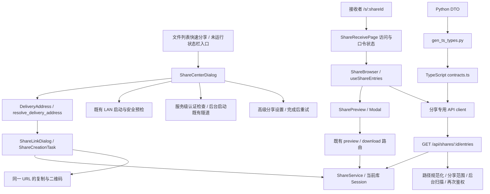

# 分享体验重写：首批可开发框架

日期：2026-09-09。用户授权“搭建框架”；主代理整合，三个 gpt-5.6-terra 执行子代理分别负责桌面、分享 API、WebUI。此交付实现第一批工作代码，双网络真机验收与完整一键配置仍属于后续任务。

## 1. 本批框架



没有引入新的前端框架、数据库、服务生命周期或远程通道提供方。

## 2. 开发入口与职责

| 文件 | 职责与扩展位置 |
|---|---|
| `AssetsManager/dialogs/share_center_dialog.py` | 内容选择、同网/互联网方式、准备状态、高级设置与结果；协调现有创建对话框 |
| `AssetsManager/application/share_delivery.py` | 显式区分 LAN 与 public 地址；公网地址缺失时不回退到局域网地址 |
| `AssetsManager/widgets/lan_sharing.py` | 从当前库 Runtime 取得 ShareService，注入延迟启动与设置回调 |
| `AssetsManager/dialogs/sharing_settings_dialog.py` | 保留完整高级配置；既有链接表复制读取有效端点，保留 HTTPS |
| `AssetsManager/application/share_service.py` | 分享浏览的口令、有效期、撤销与范围验证，不占用下载次数 |
| `AssetsManager/lan/routes/shares.py` | 目录投影和 HTTP 错误；文件扫描在线程中执行，完成后再次鉴权 |
| `AssetsManager/lan/dto.py`、`scripts/gen_ts_types.py` | Python/TypeScript 目录数据合同唯一来源 |
| `webui/src/pages/ShareReceivePage.tsx` | 分享身份、口令、加载和失败状态；URL 查询参数保存目录 |
| `webui/src/features/shares/` | 内容浏览、分页、预览；拒绝过期异步结果，使用分享范围内 API |
| `webui/src/api/shares.ts` | info/verify/entries/preview/download 的客户端适配 |

## 3. 目录合同

```http
GET /api/shares/{id}/entries?path=album&offset=0&limit=100
```

```json
{
  "path": "album",
  "parent_path": "",
  "items": [{
    "path": "album/photo.png",
    "name": "photo.png",
    "is_dir": false,
    "size": 2048,
    "can_preview": true
  }],
  "total": 1,
  "next_offset": null
}
```

- `path=""` 表示分享首页；一般列出配置的分享路径。整个库分享 `paths=["."]` 直接列库根子项，避免出现不断点入 `.` 的导航循环。
- 仅列目录直接子项；`parent_path=null` 表示无上级，空字符串表示返回分享首页。客户端不自行生成未经授权的祖先路径。
- `offset>=0`，默认 `limit=100`，最大 200。条目按名称稳定排序；当前为目录扫描后的 offset 分页，并非大目录索引游标。
- 缺口令或 token 不属于当前分享返回 401；不存在、过期、撤销或不在范围内返回 404；非法路径/分页参数返回 400。过期首页由 info 的 `expired` 展示；目录 404 不承诺区分撤销、过期和文件消失。
- 下载上限不影响目录浏览，浏览不增加下载次数。预览能力沿用安全图片集合与 `allow_preview`，不承诺全部媒体格式可预览。
- 新接口使用 `public + browse` 路由策略。分享授权仍在处理器和 ShareService 中执行；public 不等于全库开放。

## 4. 桌面与接收端约束

桌面点击“开始分享”才请求启动。公网方式检查服务级认证，远程启动在工作线程执行；缺依赖或认证时保留选择并提供高级设置重试入口。关闭中心使迟到结果失效，不停止已有服务或其他分享。创建继续使用既有 ShareLinkDialog，因此本批仍包含第二步访问设置与“创建链接”。

WebUI 直接打开分享范围，目录、预览和下载不进入全库工作台。口令、分页请求和目录状态按当前分享隔离。预览沿用 Modal 的焦点管理、Escape 和焦点归还；复制下载结果不宣称接收设备已经保存完成。

“本机服务已启动”“生成链接”和“另一网络可访问”是不同事实。本批只验证能够观测的层级，不将本机端点就绪写成远程连通成功。

## 5. 验证记录

最终源码与构建快照：`.pytest-tmp-lead-snapshots/sharing-framework-0848c645`。Python 测试全部在此独立快照内运行，Qt 使用 offscreen，RuntimeData/临时文件由隔离器托管。

| 检查 | 最终结果 | 证据边界 |
|---|---|---|
| Python 分享 API、桌面中心、已有创建/QR/高级设置、生命周期、生成合同回归 | **142 passed / 1 skipped** | symlink 用例因当前 Windows 权限跳过；旧 ShareLinkDialog 测试产生 1 条 disconnect RuntimeWarning，未导致失败 |
| WebUI 页面、分享客户端、Modal、App、连接状态、公共合同 | **60 passed** | Vitest 组件/合同测试 |
| Chromium 浏览器 | **3 passed** | 2 项模拟 HTTP 交互：375px 浏览/预览/下载/后退、临时故障重试；1 项真实 HTTP 接口与构建 SPA 衔接 |
| TypeScript / Vite | **通过** | `npm run build` 包含 `tsc -b`；构建输出已同步到测试快照 |
| Ruff / 定向 Pyright | **通过** | 新增和受影响 Python 代码；Pyright 0 errors / 0 warnings |
| 分层、翻译、QSS、样式来源、样式方言、Web tokens、页面取数、路由能力、DTO 生成、diff 检查 | **全部通过** | 见 `static-gates.json` 的逐命令结果 |
| LAN 真机扫码 / 独立网络公网访问 | **NOT_RUN** | 本批未打开公网通道，也没有跨设备证据 |

真实 HTTP 用例由 `tests/test_support/share_browser_server.py` 提供隔离的内存 SQLite、测试文件、真实分享路由及构建产物，只绑定 `127.0.0.1` 并限时退出。其应用组合及认证中间件来自 LAN 测试夹具，因此它证明接口与 SPA 衔接，不能替代生产服务启动、安全预检或跨网络验收。该用例实际验证口令 cookie、目录、图片内容、下载与分享范围拒绝。

验证过程中修复了新路由与历史路由规则测试的区分、旧对话框 mock 导致的等待、异步结果失效处理、GUI 回调线程、样式 token 和手机文件名空间。首次 live 浏览器探针的图片选择器与装饰图标冲突，修正为按图片名查找。默认 Playwright 临时 preview 的结束流程曾未退出，最终使用限时 loopback 夹具和专用配置取得完整成功退出，未将中断运行计入通过结果。

归档：[测试与源码证据](week-2026-09-14-evidence/Q/sharing-framework-2026-09-09/README.md)。源码和构建哈希与快照一致，保留当前未提交变更，没有用旧 exe 的通过结果覆盖本批源码。

手机端浅色/深色截图已检查，文件名与操作在窄屏分行。桌面截图为 offscreen 组件渲染；显式加载本机 Segoe UI 解决夹具默认字体缺字，只用于布局检查，不是生产桌面操作验收。

## 6. 下一批按此顺序接续

| 优先级 | 工作包 | 完成判据 |
|---|---|---|
| P0 | 首次配置与创建收进中心 | 原有访问设置内嵌；缺依赖/认证在当前流程补齐；正常复用配置只需一次主要操作 |
| P0 | LAN / 公网双场景使用验收 | 同网手机扫码、另一网络打开链接，分别完成口令、目录、预览、下载并核对文件；保留失败原因 |
| P0 | 正在分享与地址更新 | 活动分享列表、撤销单条、地址变更、隧道失联后的更新/重试；各模式复制和 QR 一致 |
| P1 | 接收体验打磨 | 返回恢复滚动、网络恢复保留内容、明确下载失败反馈、预览加载/切换体验和更丰富文件信息 |
| P1 | 目录规模与媒体扩展 | 有测量后再做大目录扫描预算/游标、多格式预览；继续执行分享范围与资源预算合同 |
| 后续 | 其余 WebUI 页面迁移 | 逐步统一入口与浏览组件，保留现有管理能力 |

完整排期仍以 [下周优先级计划](../plans/weekly-priorities-2026-09-14.md) 为入口；本批提前完成框架，不意味着 S/W/Q 的全部验收完成。
